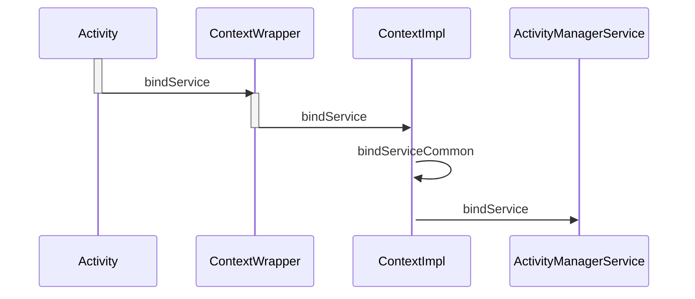
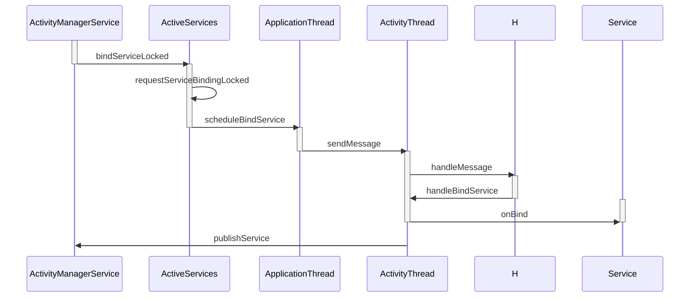
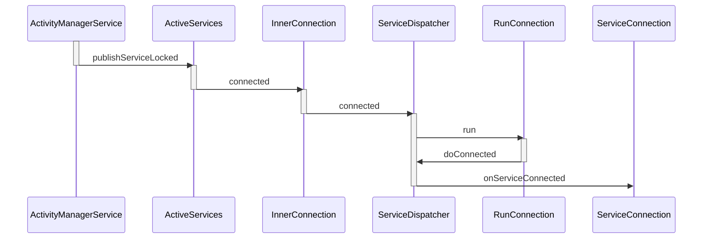

# Service绑定过程





**frameworks/base/core/java/android/content/ContextWrapper.java**

```java
 @Override
    public boolean bindService(Intent service, ServiceConnection conn,
            int flags) {
        return mBase.bindService(service, conn, flags);
    }
```


**frameworks/base/core/java/android/app/ContextImpl.java**

```java
 @Override
    public boolean bindService(Intent service, ServiceConnection conn,
            int flags) {
        warnIfCallingFromSystemProcess();
        return bindServiceCommon(service, conn, flags, mMainThread.getHandler(),
                Process.myUserHandle());
    }
```


```java
 private boolean bindServiceCommon(Intent service, ServiceConnection conn, int flags, Handler
            handler, UserHandle user) {
        // Keep this in sync with DevicePolicyManager.bindDeviceAdminServiceAsUser.
        IServiceConnection sd;
        if (conn == null) {
            throw new IllegalArgumentException("connection is null");
        }
        if (mLoadedApk != null) {
            sd = mLoadedApk.getServiceDispatcher(conn, getOuterContext(), handler, flags);
        } else {
            throw new RuntimeException("Not supported in system context");
        }
        validateServiceIntent(service);
        try {
            IBinder token = getActivityToken();
            if (token == null && (flags&BIND_AUTO_CREATE) == 0 && mLoadedApk != null
                    && mLoadedApk.getApplicationInfo().targetSdkVersion
                    < android.os.Build.VERSION_CODES.ICE_CREAM_SANDWICH) {
                flags |= BIND_WAIVE_PRIORITY;
            }
            service.prepareToLeaveProcess(this);
            int res = ActivityManager.getService().bindService(
                mMainThread.getApplicationThread(), getActivityToken(), service,
                service.resolveTypeIfNeeded(getContentResolver()),
                sd, flags, getOpPackageName(), user.getIdentifier());
            if (res < 0) {
                throw new SecurityException(
                        "Not allowed to bind to service " + service);
            }
            return res != 0;
        } catch (RemoteException e) {
            throw e.rethrowFromSystemServer();
        }
    }
```





**frameworks/base/services/core/java/com/android/server/am/ActivityManagerService.java**

```java
 public int bindService(IApplicationThread caller, IBinder token, Intent service,
            String resolvedType, IServiceConnection connection, int flags, String callingPackage,
            int userId) throws TransactionTooLargeException {
        enforceNotIsolatedCaller("bindService");

        // Refuse possible leaked file descriptors
        if (service != null && service.hasFileDescriptors() == true) {
            throw new IllegalArgumentException("File descriptors passed in Intent");
        }

        if (callingPackage == null) {
            throw new IllegalArgumentException("callingPackage cannot be null");
        }

        synchronized(this) {
            return mServices.bindServiceLocked(caller, token, service,
                    resolvedType, connection, flags, callingPackage, userId);
        }
    }
```


**frameworks/base/services/core/java/com/android/server/am/ActiveServices.java**

```java
int bindServiceLocked(IApplicationThread caller, IBinder token, Intent service,
            String resolvedType, final IServiceConnection connection, int flags,
            String callingPackage, final int userId) throws TransactionTooLargeException {
        if (DEBUG_SERVICE) Slog.v(TAG_SERVICE, "bindService: " + service
                + " type=" + resolvedType + " conn=" + connection.asBinder()
                + " flags=0x" + Integer.toHexString(flags));
        final ProcessRecord callerApp = mAm.getRecordForAppLocked(caller);
        if (callerApp == null) {
            throw new SecurityException(
                    "Unable to find app for caller " + caller
                    + " (pid=" + Binder.getCallingPid()
                    + ") when binding service " + service);
        }

        ActivityRecord activity = null;
        if (token != null) {
            activity = ActivityRecord.isInStackLocked(token);
            if (activity == null) {
                Slog.w(TAG, "Binding with unknown activity: " + token);
                return 0;
            }
        }

        int clientLabel = 0;
        PendingIntent clientIntent = null;
        final boolean isCallerSystem = callerApp.info.uid == Process.SYSTEM_UID;

        if (isCallerSystem) {
            // Hacky kind of thing -- allow system stuff to tell us
            // what they are, so we can report this elsewhere for
            // others to know why certain services are running.
            service.setDefusable(true);
            clientIntent = service.getParcelableExtra(Intent.EXTRA_CLIENT_INTENT);
            if (clientIntent != null) {
                clientLabel = service.getIntExtra(Intent.EXTRA_CLIENT_LABEL, 0);
                if (clientLabel != 0) {
                    // There are no useful extras in the intent, trash them.
                    // System code calling with this stuff just needs to know
                    // this will happen.
                    service = service.cloneFilter();
                }
            }
        }

        if ((flags&Context.BIND_TREAT_LIKE_ACTIVITY) != 0) {
            mAm.enforceCallingPermission(android.Manifest.permission.MANAGE_ACTIVITY_STACKS,
                    "BIND_TREAT_LIKE_ACTIVITY");
        }

        if ((flags & Context.BIND_ALLOW_WHITELIST_MANAGEMENT) != 0 && !isCallerSystem) {
            throw new SecurityException(
                    "Non-system caller " + caller + " (pid=" + Binder.getCallingPid()
                    + ") set BIND_ALLOW_WHITELIST_MANAGEMENT when binding service " + service);
        }

        final boolean callerFg = callerApp.setSchedGroup != ProcessList.SCHED_GROUP_BACKGROUND;
        final boolean isBindExternal = (flags & Context.BIND_EXTERNAL_SERVICE) != 0;

        ServiceLookupResult res =
            retrieveServiceLocked(service, resolvedType, callingPackage, Binder.getCallingPid(),
                    Binder.getCallingUid(), userId, true, callerFg, isBindExternal);
        if (res == null) {
            return 0;
        }
        if (res.record == null) {
            return -1;
        }
        ServiceRecord s = res.record;

        boolean permissionsReviewRequired = false;

        // If permissions need a review before any of the app components can run,
        // we schedule binding to the service but do not start its process, then
        // we launch a review activity to which is passed a callback to invoke
        // when done to start the bound service's process to completing the binding.
        if (mAm.mPermissionReviewRequired) {
            if (mAm.getPackageManagerInternalLocked().isPermissionsReviewRequired(
                    s.packageName, s.userId)) {

                permissionsReviewRequired = true;

                // Show a permission review UI only for binding from a foreground app
                if (!callerFg) {
                    Slog.w(TAG, "u" + s.userId + " Binding to a service in package"
                            + s.packageName + " requires a permissions review");
                    return 0;
                }

                final ServiceRecord serviceRecord = s;
                final Intent serviceIntent = service;

                RemoteCallback callback = new RemoteCallback(
                        new RemoteCallback.OnResultListener() {
                    @Override
                    public void onResult(Bundle result) {
                        synchronized(mAm) {
                            final long identity = Binder.clearCallingIdentity();
                            try {
                                if (!mPendingServices.contains(serviceRecord)) {
                                    return;
                                }
                                // If there is still a pending record, then the service
                                // binding request is still valid, so hook them up. We
                                // proceed only if the caller cleared the review requirement
                                // otherwise we unbind because the user didn't approve.
                                if (!mAm.getPackageManagerInternalLocked()
                                        .isPermissionsReviewRequired(
                                                serviceRecord.packageName,
                                                serviceRecord.userId)) {
                                    try {
                                        bringUpServiceLocked(serviceRecord,
                                                serviceIntent.getFlags(),
                                                callerFg, false, false);
                                    } catch (RemoteException e) {
                                        /* ignore - local call */
                                    }
                                } else {
                                    unbindServiceLocked(connection);
                                }
                            } finally {
                                Binder.restoreCallingIdentity(identity);
                            }
                        }
                    }
                });

                final Intent intent = new Intent(Intent.ACTION_REVIEW_PERMISSIONS);
                intent.addFlags(Intent.FLAG_ACTIVITY_NEW_TASK
                        | Intent.FLAG_ACTIVITY_EXCLUDE_FROM_RECENTS);
                intent.putExtra(Intent.EXTRA_PACKAGE_NAME, s.packageName);
                intent.putExtra(Intent.EXTRA_REMOTE_CALLBACK, callback);

                if (DEBUG_PERMISSIONS_REVIEW) {
                    Slog.i(TAG, "u" + s.userId + " Launching permission review for package "
                            + s.packageName);
                }

                mAm.mHandler.post(new Runnable() {
                    @Override
                    public void run() {
                        mAm.mContext.startActivityAsUser(intent, new UserHandle(userId));
                    }
                });
            }
        }

        final long origId = Binder.clearCallingIdentity();

        try {
            if (unscheduleServiceRestartLocked(s, callerApp.info.uid, false)) {
                if (DEBUG_SERVICE) Slog.v(TAG_SERVICE, "BIND SERVICE WHILE RESTART PENDING: "
                        + s);
            }

            if ((flags&Context.BIND_AUTO_CREATE) != 0) {
                s.lastActivity = SystemClock.uptimeMillis();
                if (!s.hasAutoCreateConnections()) {
                    // This is the first binding, let the tracker know.
                    ServiceState stracker = s.getTracker();
                    if (stracker != null) {
                        stracker.setBound(true, mAm.mProcessStats.getMemFactorLocked(),
                                s.lastActivity);
                    }
                }
            }

            mAm.startAssociationLocked(callerApp.uid, callerApp.processName, callerApp.curProcState,
                    s.appInfo.uid, s.name, s.processName);
            // Once the apps have become associated, if one of them is caller is ephemeral
            // the target app should now be able to see the calling app
            mAm.grantEphemeralAccessLocked(callerApp.userId, service,
                    s.appInfo.uid, UserHandle.getAppId(callerApp.uid));

            AppBindRecord b = s.retrieveAppBindingLocked(service, callerApp);
            ConnectionRecord c = new ConnectionRecord(b, activity,
                    connection, flags, clientLabel, clientIntent);

            IBinder binder = connection.asBinder();
            ArrayList<ConnectionRecord> clist = s.connections.get(binder);
            if (clist == null) {
                clist = new ArrayList<ConnectionRecord>();
                s.connections.put(binder, clist);
            }
            clist.add(c);
            b.connections.add(c);
            if (activity != null) {
                if (activity.connections == null) {
                    activity.connections = new HashSet<ConnectionRecord>();
                }
                activity.connections.add(c);
            }
            b.client.connections.add(c);
            if ((c.flags&Context.BIND_ABOVE_CLIENT) != 0) {
                b.client.hasAboveClient = true;
            }
            if ((c.flags&Context.BIND_ALLOW_WHITELIST_MANAGEMENT) != 0) {
                s.whitelistManager = true;
            }
            if (s.app != null) {
                updateServiceClientActivitiesLocked(s.app, c, true);
            }
            clist = mServiceConnections.get(binder);
            if (clist == null) {
                clist = new ArrayList<ConnectionRecord>();
                mServiceConnections.put(binder, clist);
            }
            clist.add(c);

            if ((flags&Context.BIND_AUTO_CREATE) != 0) {
                s.lastActivity = SystemClock.uptimeMillis();
                if (bringUpServiceLocked(s, service.getFlags(), callerFg, false,
                        permissionsReviewRequired) != null) {
                    return 0;
                }
            }

            if (s.app != null) {
                if ((flags&Context.BIND_TREAT_LIKE_ACTIVITY) != 0) {
                    s.app.treatLikeActivity = true;
                }
                if (s.whitelistManager) {
                    s.app.whitelistManager = true;
                }
                // This could have made the service more important.
                mAm.updateLruProcessLocked(s.app, s.app.hasClientActivities
                        || s.app.treatLikeActivity, b.client);
                mAm.updateOomAdjLocked(s.app, true);
            }

            if (DEBUG_SERVICE) Slog.v(TAG_SERVICE, "Bind " + s + " with " + b
                    + ": received=" + b.intent.received
                    + " apps=" + b.intent.apps.size()
                    + " doRebind=" + b.intent.doRebind);

            if (s.app != null && b.intent.received) {
                // Service is already running, so we can immediately
                // publish the connection.
                try {
                    c.conn.connected(s.name, b.intent.binder, false);
                } catch (Exception e) {
                    Slog.w(TAG, "Failure sending service " + s.shortName
                            + " to connection " + c.conn.asBinder()
                            + " (in " + c.binding.client.processName + ")", e);
                }

                // If this is the first app connected back to this binding,
                // and the service had previously asked to be told when
                // rebound, then do so.
                if (b.intent.apps.size() == 1 && b.intent.doRebind) {
                    requestServiceBindingLocked(s, b.intent, callerFg, true);
                }
            } else if (!b.intent.requested) {
                requestServiceBindingLocked(s, b.intent, callerFg, false);
            }

            getServiceMapLocked(s.userId).ensureNotStartingBackgroundLocked(s);

        } finally {
            Binder.restoreCallingIdentity(origId);
        }

        return 1;
    }

```


```java
 private final boolean requestServiceBindingLocked(ServiceRecord r, IntentBindRecord i,
            boolean execInFg, boolean rebind) throws TransactionTooLargeException {
        if (r.app == null || r.app.thread == null) {
            // If service is not currently running, can't yet bind.
            return false;
        }
        if (DEBUG_SERVICE) Slog.d(TAG_SERVICE, "requestBind " + i + ": requested=" + i.requested
                + " rebind=" + rebind);
        if ((!i.requested || rebind) && i.apps.size() > 0) {
            try {
                bumpServiceExecutingLocked(r, execInFg, "bind");
                r.app.forceProcessStateUpTo(ActivityManager.PROCESS_STATE_SERVICE);
                r.app.thread.scheduleBindService(r, i.intent.getIntent(), rebind,
                        r.app.repProcState);
                if (!rebind) {
                    i.requested = true;
                }
                i.hasBound = true;
                i.doRebind = false;
            } catch (TransactionTooLargeException e) {
                // Keep the executeNesting count accurate.
                if (DEBUG_SERVICE) Slog.v(TAG_SERVICE, "Crashed while binding " + r, e);
                final boolean inDestroying = mDestroyingServices.contains(r);
                serviceDoneExecutingLocked(r, inDestroying, inDestroying);
                throw e;
            } catch (RemoteException e) {
                if (DEBUG_SERVICE) Slog.v(TAG_SERVICE, "Crashed while binding " + r);
                // Keep the executeNesting count accurate.
                final boolean inDestroying = mDestroyingServices.contains(r);
                serviceDoneExecutingLocked(r, inDestroying, inDestroying);
                return false;
            }
        }
        return true;
    }
```


**frameworks/base/core/java/android/app/ActivityThread.java**

```java
 public final void scheduleBindService(IBinder token, Intent intent,
                boolean rebind, int processState) {
            updateProcessState(processState, false);
            BindServiceData s = new BindServiceData();
            s.token = token;
            s.intent = intent;
            s.rebind = rebind;

            if (DEBUG_SERVICE)
                Slog.v(TAG, "scheduleBindService token=" + token + " intent=" + intent + " uid="
                        + Binder.getCallingUid() + " pid=" + Binder.getCallingPid());
            sendMessage(H.BIND_SERVICE, s);
        }
```


```java
 private void sendMessage(int what, Object obj) {
        sendMessage(what, obj, 0, 0, false);
    }
```


```java
private class H extends Handler {
     public void handleMessage(Message msg) {
            if (DEBUG_MESSAGES) Slog.v(TAG, ">>> handling: " + codeToString(msg.what));
            switch (msg.what) {
              case BIND_SERVICE:
                    Trace.traceBegin(Trace.TRACE_TAG_ACTIVITY_MANAGER, "serviceBind");
                    handleBindService((BindServiceData)msg.obj);
                    Trace.traceEnd(Trace.TRACE_TAG_ACTIVITY_MANAGER);
                    break;
                // 省略
            }
        // 省略
 }
```


```java
private void handleBindService(BindServiceData data) {
        Service s = mServices.get(data.token);
        if (DEBUG_SERVICE)
            Slog.v(TAG, "handleBindService s=" + s + " rebind=" + data.rebind);
        if (s != null) {
            try {
                data.intent.setExtrasClassLoader(s.getClassLoader());
                data.intent.prepareToEnterProcess();
                try {
                    if (!data.rebind) {
                        IBinder binder = s.onBind(data.intent);
                        ActivityManager.getService().publishService(
                                data.token, data.intent, binder);
                    } else {
                        s.onRebind(data.intent);
                        ActivityManager.getService().serviceDoneExecuting(
                                data.token, SERVICE_DONE_EXECUTING_ANON, 0, 0);
                    }
                    ensureJitEnabled();
                } catch (RemoteException ex) {
                    throw ex.rethrowFromSystemServer();
                }
            } catch (Exception e) {
                if (!mInstrumentation.onException(s, e)) {
                    throw new RuntimeException(
                            "Unable to bind to service " + s
                            + " with " + data.intent + ": " + e.toString(), e);
                }
            }
        }
    }
```





**frameworks/base/services/core/java/com/android/server/am/ActivityManagerService.java**

```java
 public void publishService(IBinder token, Intent intent, IBinder service) {
        // Refuse possible leaked file descriptors
        if (intent != null && intent.hasFileDescriptors() == true) {
            throw new IllegalArgumentException("File descriptors passed in Intent");
        }

        synchronized(this) {
            if (!(token instanceof ServiceRecord)) {
                throw new IllegalArgumentException("Invalid service token");
            }
            mServices.publishServiceLocked((ServiceRecord)token, intent, service);
        }
    }
```


**frameworks/base/services/core/java/com/android/server/am/ActiveServices.java**

```java
 void publishServiceLocked(ServiceRecord r, Intent intent, IBinder service) {
        final long origId = Binder.clearCallingIdentity();
        try {
            if (DEBUG_SERVICE) Slog.v(TAG_SERVICE, "PUBLISHING " + r
                    + " " + intent + ": " + service);
            if (r != null) {
                Intent.FilterComparison filter
                        = new Intent.FilterComparison(intent);
                IntentBindRecord b = r.bindings.get(filter);
                if (b != null && !b.received) {
                    b.binder = service;
                    b.requested = true;
                    b.received = true;
                    for (int conni=r.connections.size()-1; conni>=0; conni--) {
                        ArrayList<ConnectionRecord> clist = r.connections.valueAt(conni);
                        for (int i=0; i<clist.size(); i++) {
                            ConnectionRecord c = clist.get(i);
                            if (!filter.equals(c.binding.intent.intent)) {
                                if (DEBUG_SERVICE) Slog.v(
                                        TAG_SERVICE, "Not publishing to: " + c);
                                if (DEBUG_SERVICE) Slog.v(
                                        TAG_SERVICE, "Bound intent: " + c.binding.intent.intent);
                                if (DEBUG_SERVICE) Slog.v(
                                        TAG_SERVICE, "Published intent: " + intent);
                                continue;
                            }
                            if (DEBUG_SERVICE) Slog.v(TAG_SERVICE, "Publishing to: " + c);
                            try {
                                c.conn.connected(r.name, service, false);
                            } catch (Exception e) {
                                Slog.w(TAG, "Failure sending service " + r.name +
                                      " to connection " + c.conn.asBinder() +
                                      " (in " + c.binding.client.processName + ")", e);
                            }
                        }
                    }
                }

                serviceDoneExecutingLocked(r, mDestroyingServices.contains(r), false);
            }
        } finally {
            Binder.restoreCallingIdentity(origId);
        }
    }
```

c.conn指的是IServiceConnection，它的具体实现为ServiceDispatcher.InnerConnection，其中ServiceDispatcher是LoadedApk的内部类，ServiceDispatcher.InnerConnectiond的connected方法的代码如下所示。

**frameworks/base/core/java/android/app/LoadedApk.java**


```java
static final class ServiceDispatcher {
    // 省略
   private static class InnerConnection extends IServiceConnection.Stub {
            final WeakReference<LoadedApk.ServiceDispatcher> mDispatcher;

            InnerConnection(LoadedApk.ServiceDispatcher sd) {
                mDispatcher = new WeakReference<LoadedApk.ServiceDispatcher>(sd);
            }

            public void connected(ComponentName name, IBinder service, boolean dead)
                    throws RemoteException {
                LoadedApk.ServiceDispatcher sd = mDispatcher.get();
                if (sd != null) {
                    sd.connected(name, service, dead);
                }
            }
        }
    // 省略
}
```


```java
 	public void connected(ComponentName name, IBinder service, boolean dead) {
            if (mActivityThread != null) {
                mActivityThread.post(new RunConnection(name, service, 0, dead));
            } else {
                doConnected(name, service, dead);
            }
        }
```


```java
private final class RunConnection implements Runnable {
            RunConnection(ComponentName name, IBinder service, int command, boolean dead) {
                mName = name;
                mService = service;
                mCommand = command;
                mDead = dead;
            }

            public void run() {
                if (mCommand == 0) {
                    doConnected(mName, mService, mDead);
                } else if (mCommand == 1) {
                    doDeath(mName, mService);
                }
            }

            final ComponentName mName;
            final IBinder mService;
            final int mCommand;
            final boolean mDead;
        }
```


```java
 public void doConnected(ComponentName name, IBinder service, boolean dead) {
            ServiceDispatcher.ConnectionInfo old;
            ServiceDispatcher.ConnectionInfo info;

            synchronized (this) {
                if (mForgotten) {
                    // We unbound before receiving the connection; ignore
                    // any connection received.
                    return;
                }
                old = mActiveConnections.get(name);
                if (old != null && old.binder == service) {
                    // Huh, already have this one.  Oh well!
                    return;
                }

                if (service != null) {
                    // A new service is being connected... set it all up.
                    info = new ConnectionInfo();
                    info.binder = service;
                    info.deathMonitor = new DeathMonitor(name, service);
                    try {
                        service.linkToDeath(info.deathMonitor, 0);
                        mActiveConnections.put(name, info);
                    } catch (RemoteException e) {
                        // This service was dead before we got it...  just
                        // don't do anything with it.
                        mActiveConnections.remove(name);
                        return;
                    }

                } else {
                    // The named service is being disconnected... clean up.
                    mActiveConnections.remove(name);
                }

                if (old != null) {
                    old.binder.unlinkToDeath(old.deathMonitor, 0);
                }
            }

            // If there was an old service, it is now disconnected.
            if (old != null) {
                mConnection.onServiceDisconnected(name);
            }
            if (dead) {
                mConnection.onBindingDied(name);
            }
            // If there is a new service, it is now connected.
            if (service != null) {
                mConnection.onServiceConnected(name, service);
            }
        }
```

