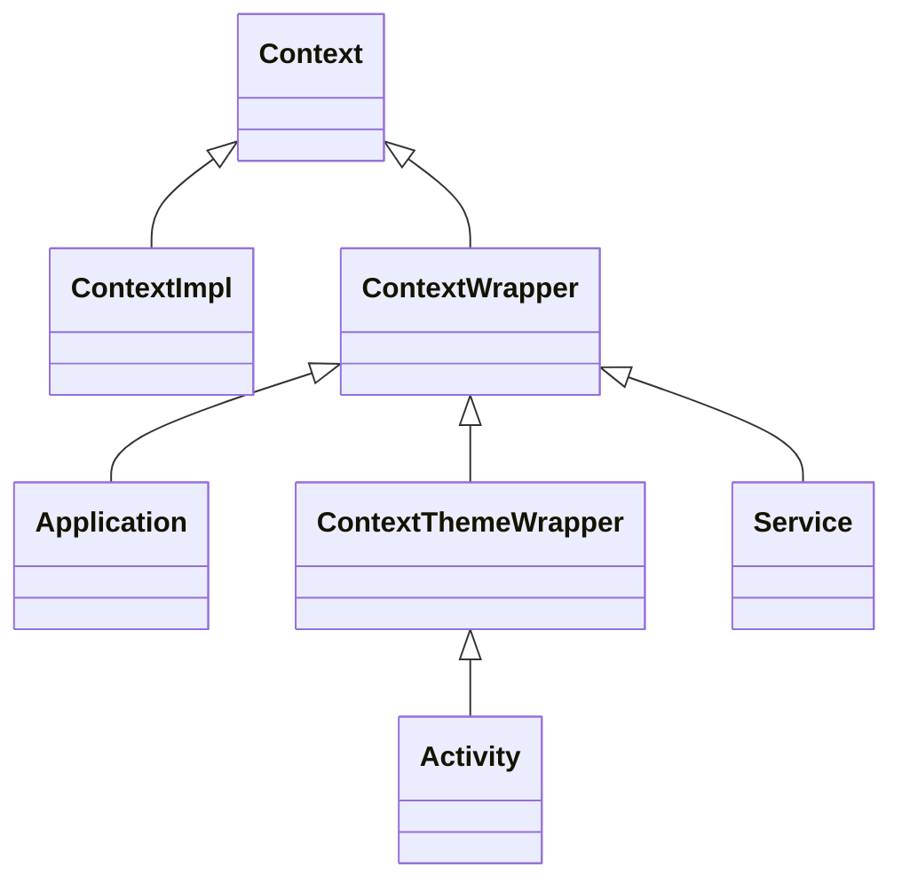
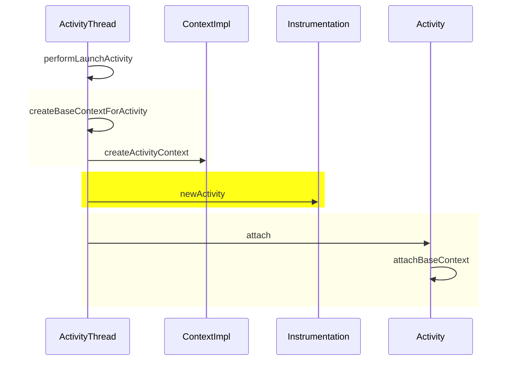

# 无处不在的Context

一般写代码时，都会有main方法作为整个程序的入口，而Android开发不需如此，系统弱化了main的入口的概念，而是提供了Activity，Service等组件的概念，而如何启动，完全由系统提供。开发者只需要关心APP的需要哪些组件，实现哪些逻辑即可。从开始写Android的第一行代码，就一直在和Context打交道，然而，什么是Context，它做了哪些工作，背后的工作原理是怎样的呢？

## 什么是Context

先看官方对Context的注释

> 
> Interface to global information about an application environment.  This is an abstract class whose implementation is provided by the Android system.  It allows access to application-specific resources and classes, as well as  up-calls for application-level operations such as launching activities,  broadcasting and receiving intents, etc.

它为应用环境提供全局性的接口。是一个抽象类，实现逻辑由ContextImpl提供。可以通过Context访问APP的相关资源，也提供一些应用级别的操作，包括启动Activity，发送广播，绑定服务等。

- 获取应用资源，譬如：drawable、string、assets
- 操作四大组件，譬如：启动界面、发送广播、绑定服务、打开数据库
- 操作文件目录，譬如：获取/data/分区的数据目录、获取sdcard目录
- 检查授予权限，譬如：应用向外提供服务时，可以判定申请者是否具备访问权限
- 获取其他服务，有一些服务有专门的提供者，譬如：包管理服务、Activity管理服务、窗口管理服务

## Context设计

上图可以看到，Application、Activity、Service本质上都是一个Context，但真正的实现是ContextImpl。Context使用的是装饰器模式。装饰器模式（Decorator Pattern）允许向一个现有的对象添加新的功能，同时又不改变其结构。

由上面的类图，可以知道，每个APP中的Context对象的个数为：Application + Activity + Service

## Activity 绑定Context的过程

整体流程
1. 创建ContextImpl对象
2. 创建Activity对象
3. 将ContextImpl对象包装到Activity中

##  不同类型的Context的有何区别

Activity中获取Context的方式

- getApplication()
- getApplicationContext()
- getBaseContext()
- Activity.this

- getApplication()和getApplicationContext()返回的是同一个对象`com.duanqz.github.DemoApp@cf8644e`，虽然同一块内存区域，但对象的类型不同：前者是Application，后者是Context。Java是强类型的语言，Application到Context相当于向上转型，会丢失掉一些接口的访问入口。
- 同理，Activity和Activity Context也是同一个对象，不同的类型。
- Application和Activity的Base Context都是ContextImpl对象，正是这个Context真正的实现类，被外围的修饰器包装了一下，才形成不同功能的类。

## Context导致的内存泄露

Context经常作为参数进行传递，如果使用不当，很容易造成内存泄露。比如，在单例中持有Activity的Context对象，由于单例的生命周期比Activity的生命周期要长，而Activity被销毁后，单例仍然持有Activity的Context，从而不能被垃圾回收器回收，导致内存泄露。

> 单例的实现都包含一个静态变量，而在Java的垃圾回收机制中，静态变量是GC ROOT，某对象只要存在到达GC ROOT的路径，就不会被回收。其实，所谓的内存泄露，都是生命周期短的对象没有被正确的回收，之所以没有被回收，是因为它们处在到GC ROOT的路径上，像静态变量、类加载器等都是GC ROOT，在使用过程如果关联到了生命周期短的对象，而且没有及时解除关联，就会产生内存泄露。

因此，在单例或者工具类中，应该使用Application Context对象。