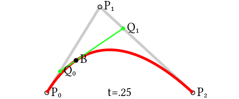

# 贝塞尔曲线

## 一阶曲线原理

给定点**P**0、**P**1，线性贝塞尔曲线只是一条两点之间的直线。这条线由下式给出：

$B(t)={\mathbf  {P}}_{0}+({\mathbf  {P}}_{1}-{\mathbf  {P}}_{0})t=(1-t){\mathbf  {P}}_{0}+t{\mathbf  {P}}_{1}{\mbox{ , }}t\in [0,1]]$

一阶曲线是没有控制点的，仅有两个数据点(A 和 B)，最终效果是一个线段。**一阶曲线对应的方法为lineTo**

## 二阶曲线原理

二次方贝塞尔曲线的路径由给定点**P**0、**P**1、**P**2的函数**B**（*t*）追踪：

${\mathbf  {B}}(t)=(1-t)^{{2}}{\mathbf  {P}}_{0}+2t(1-t){\mathbf  {P}}_{1}+t^{{2}}{\mathbf  {P}}_{2}{\mbox{ , }}t\in [0,1]]$

**P**0和**P**2为数据点，**P**1为控制点。

为建构二次贝塞尔曲线，可以中介点**Q**0和**Q**1作为由0至1的*t*：

- 由**P**0至**P**1的连续点**Q**0，描述一条线性贝塞尔曲线。
- 由**P**1至**P**2的连续点**Q**1，描述一条线性贝塞尔曲线。
- 由**Q**0至**Q**1的连续点**B**（*t*），描述一条二次贝塞尔曲线。

**二阶曲线对应的方法是quadTo**

## 三阶曲线原理

三阶曲线与二阶曲线原理类似。三阶曲线由两个数据点和两个控制点组成。

**三阶曲线对应的方法是cubicTo**

## 贝塞尔曲线使用

#### 降阶与升阶

| 类型 | 释义                                                         | 变化                                                 |
| ---- | ------------------------------------------------------------ | ---------------------------------------------------- |
| 降阶 | 在保持曲线形状与方向不变的情况下，减少控制点数量，即降低曲线阶数 | 方法变得简单，数据点变多，控制点可能减少，灵活性变弱 |
| 升阶 | 在保持曲线形状与方向不变的情况下，增加控制点数量，即升高曲线阶数 | 方法更加复杂，数据点不变，控制点增加，灵活性变强     |

### 使用贝塞尔曲线绘制圆形

So for 4 points it is `(4/3)*tan(pi/8) = 4*(sqrt(2)-1)/3 = 0.552284749831`.

