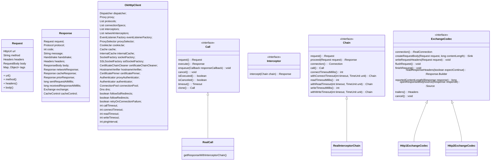
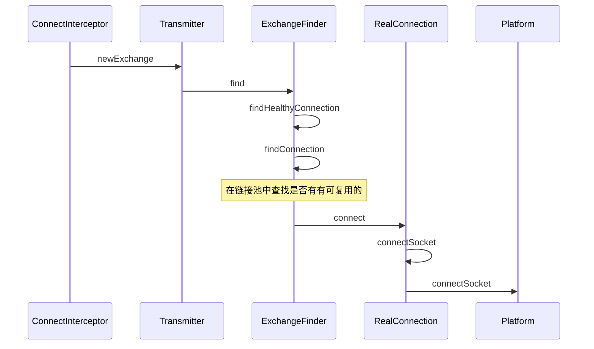

## OKHttp整体流程

### 创建Request

创建请求Request，包括url，method，headers，requestBody

- url 

支持http和https

使用HttpUrl.Builder.parse方法，将url解析成scheme、host、port、path、query等

- method

请求方法，包括get，post，head，put，delete，connect，options，trace，patch

- headers

请求header，包括content-type，content-length，referer，user-agent，Accept-Encoding，cookie等等

- requestBody

请求body有多种类型，比如说json，表单，mutipart-formdata


###执行请求

 分为同步执行和异步执行

- 同步执行

```java
Response response = client.newCall(request).execute();
```

- 异步执行

```java
client.newCall(request).enqueue(callback);
```

异步执行会将任务添加到请求队列，然后调用AsyncCall#execute执行

```java
@Override protected void execute() {
      boolean signalledCallback = false;
      transmitter.timeoutEnter();
      try {
        Response response = getResponseWithInterceptorChain();
        signalledCallback = true;
        responseCallback.onResponse(RealCall.this, response);
      } catch (IOException e) {
        if (signalledCallback) {
          // Do not signal the callback twice!
          Platform.get().log(INFO, "Callback failure for " + toLoggableString(), e);
        } else {
          responseCallback.onFailure(RealCall.this, e);
        }
      } catch (Throwable t) {
        cancel();
        if (!signalledCallback) {
          IOException canceledException = new IOException("canceled due to " + t);
          canceledException.addSuppressed(t);
          responseCallback.onFailure(RealCall.this, canceledException);
        }
        throw t;
      } finally {
        client.dispatcher().finished(this);
      }
    }
  }
```

```java
Response getResponseWithInterceptorChain() throws IOException {
    // Build a full stack of interceptors.
    List<Interceptor> interceptors = new ArrayList<>();
    interceptors.addAll(client.interceptors());
    interceptors.add(new RetryAndFollowUpInterceptor(client));
    interceptors.add(new BridgeInterceptor(client.cookieJar()));
    interceptors.add(new CacheInterceptor(client.internalCache()));
    interceptors.add(new ConnectInterceptor(client));
    if (!forWebSocket) {
      interceptors.addAll(client.networkInterceptors());
    }
    interceptors.add(new CallServerInterceptor(forWebSocket));

    Interceptor.Chain chain = new RealInterceptorChain(interceptors, transmitter, null, 0,
        originalRequest, this, client.connectTimeoutMillis(),
        client.readTimeoutMillis(), client.writeTimeoutMillis());

    boolean calledNoMoreExchanges = false;
    try {
      Response response = chain.proceed(originalRequest);
      if (transmitter.isCanceled()) {
        closeQuietly(response);
        throw new IOException("Canceled");
      }
      return response;
    } catch (IOException e) {
      calledNoMoreExchanges = true;
      throw transmitter.noMoreExchanges(e);
    } finally {
      if (!calledNoMoreExchanges) {
        transmitter.noMoreExchanges(null);
      }
    }
  }
```

上面代码很清晰，将各种intercept添加到list，作为参数创建RealInterceptorChain实例，执行proceed方法，然后就拿到Response。最后将response塞给回调接口ResponseCallback#onResponse。

## intercept

上面流程很简单，要弄清楚okhttp的工作原理，需要看procced中都做了哪些事情？


```java
Interceptor.Chain chain = new RealInterceptorChain(interceptors, transmitter, null, 0,
        originalRequest, this, client.connectTimeoutMillis(),
        client.readTimeoutMillis(), client.writeTimeoutMillis());
Response response = chain.proceed(originalRequest);

public Response proceed(Request request, Transmitter transmitter, @Nullable Exchange exchange)
      throws IOException {
    if (index >= interceptors.size()) throw new AssertionError();

    calls++;

    // If we already have a stream, confirm that the incoming request will use it.
    if (this.exchange != null && !this.exchange.connection().supportsUrl(request.url())) {
      throw new IllegalStateException("network interceptor " + interceptors.get(index - 1)
          + " must retain the same host and port");
    }

    // If we already have a stream, confirm that this is the only call to chain.proceed().
    if (this.exchange != null && calls > 1) {
      throw new IllegalStateException("network interceptor " + interceptors.get(index - 1)
          + " must call proceed() exactly once");
    }

    // Call the next interceptor in the chain.
    RealInterceptorChain next = new RealInterceptorChain(interceptors, transmitter, exchange,
        index + 1, request, call, connectTimeout, readTimeout, writeTimeout);
    Interceptor interceptor = interceptors.get(index);
    Response response = interceptor.intercept(next);

    // Confirm that the next interceptor made its required call to chain.proceed().
    if (exchange != null && index + 1 < interceptors.size() && next.calls != 1) {
      throw new IllegalStateException("network interceptor " + interceptor
          + " must call proceed() exactly once");
    }

    // Confirm that the intercepted response isn't null.
    if (response == null) {
      throw new NullPointerException("interceptor " + interceptor + " returned null");
    }

    if (response.body() == null) {
      throw new IllegalStateException(
          "interceptor " + interceptor + " returned a response with no body");
    }

    return response;
  }
```


RetryAndFollowUpInterceptor——失败和重定向拦截器

BridgeInterceptor——封装request和response拦截器

CacheInterceptor——缓存相关的过滤器，负责读取缓存直接返回、更新缓存

ConnectInterceptor——连接服务，负责和服务器建立连接 这里才是真正的请求网络

CallServerInterceptor——执行流操作(写出请求体、获得响应数据) 负责向服务器发送请求数据、从服务器读取响应数据 进行http请求报文的封装与请求报文的解析


### RetryAndFollowUpInterceptor

从上图中可以看出，RetryAndFollowUpInterceptor开启了一个while(true)的循环，并在循环内部完成两个重要的判定：

1. 当请求内部抛出异常时，判定是否需要重试
2. 当响应结果是3xx重定向时，构建新的请求并发送请求

```java
@Override public Response intercept(Chain chain) throws IOException {
    Request request = chain.request();
    RealInterceptorChain realChain = (RealInterceptorChain) chain;
    Transmitter transmitter = realChain.transmitter();

    int followUpCount = 0;
    Response priorResponse = null;
    while (true) {
      transmitter.prepareToConnect(request);

      if (transmitter.isCanceled()) {
        throw new IOException("Canceled");
      }

      Response response;
      boolean success = false;
      try {
        response = realChain.proceed(request, transmitter, null);
        success = true;
      } catch (RouteException e) {
        // The attempt to connect via a route failed. The request will not have been sent.
        if (!recover(e.getLastConnectException(), transmitter, false, request)) {
          throw e.getFirstConnectException();
        }
        continue;
      } catch (IOException e) {
        // An attempt to communicate with a server failed. The request may have been sent.
        boolean requestSendStarted = !(e instanceof ConnectionShutdownException);
        if (!recover(e, transmitter, requestSendStarted, request)) throw e;
        continue;
      } finally {
        // The network call threw an exception. Release any resources.
        if (!success) {
          transmitter.exchangeDoneDueToException();
        }
      }

      // Attach the prior response if it exists. Such responses never have a body.
      if (priorResponse != null) {
        response = response.newBuilder()
            .priorResponse(priorResponse.newBuilder()
                    .body(null)
                    .build())
            .build();
      }

      Exchange exchange = Internal.instance.exchange(response);
      Route route = exchange != null ? exchange.connection().route() : null;
      Request followUp = followUpRequest(response, route);
			
      // followUp request为null，不进行重定向
      if (followUp == null) {
        if (exchange != null && exchange.isDuplex()) {
          transmitter.timeoutEarlyExit();
        }
        return response;
      }

      RequestBody followUpBody = followUp.body();
      // 请求body为null，且requestbody仅可以传输一次
      if (followUpBody != null && followUpBody.isOneShot()) {
        return response;
      }

      closeQuietly(response.body());
      if (transmitter.hasExchange()) {
        exchange.detachWithViolence();
      }
			// 达到最大重定向次数20，抛出异常
      if (++followUpCount > MAX_FOLLOW_UPS) {
        throw new ProtocolException("Too many follow-up requests: " + followUpCount);
      }
			
      request = followUp;
      priorResponse = response;
    }
  }
```

#### 重试

重试的逻辑相对复杂，有如下的判定逻辑（具体代码在RetryAndFollowUpInterceptor类的recover方法）：

- 规则1: client的retryOnConnectionFailure参数设置为false，不进行重试
- 规则2: 请求的body已经发出，不进行重试
- 规则3: 特殊的异常类型不进行重试（如ProtocolException，SSLHandshakeException等）
- 规则4: 没有更多的route（包含proxy和inetaddress），不进行重试

```java
 private boolean recover(IOException e, Transmitter transmitter,
      boolean requestSendStarted, Request userRequest) {
    // The application layer has forbidden retries.
    // 是否禁止重试
    if (!client.retryOnConnectionFailure()) return false;

    // We can't send the request body again.
    if (requestSendStarted && requestIsOneShot(e, userRequest)) return false;

    // This exception is fatal.
    if (!isRecoverable(e, requestSendStarted)) return false;

    // No more routes to attempt.
    if (!transmitter.canRetry()) return false;

    // For failure recovery, use the same route selector with a new connection.
    return true;
  }

```

#### 重定向

1. followUpRequest为null，不进行重定向
2. followUpRequestBody为null，且requestbody仅可以传输一次，不进行重定向
3. 达到最大重定向次数20，抛出异常，不进行重定向

```java
private Request followUpRequest(Response userResponse, @Nullable Route route) throws IOException {
    if (userResponse == null) throw new IllegalStateException();
    int responseCode = userResponse.code();

    final String method = userResponse.request().method();
    switch (responseCode) {
      case HTTP_PROXY_AUTH:
        Proxy selectedProxy = route != null
            ? route.proxy()
            : client.proxy();
        if (selectedProxy.type() != Proxy.Type.HTTP) {
          throw new ProtocolException("Received HTTP_PROXY_AUTH (407) code while not using proxy");
        }
        return client.proxyAuthenticator().authenticate(route, userResponse);

      case HTTP_UNAUTHORIZED:
        return client.authenticator().authenticate(route, userResponse);

      case HTTP_PERM_REDIRECT:
      case HTTP_TEMP_REDIRECT:
        // "If the 307 or 308 status code is received in response to a request other than GET
        // or HEAD, the user agent MUST NOT automatically redirect the request"
        if (!method.equals("GET") && !method.equals("HEAD")) {
          return null;
        }
        // fall-through
      case HTTP_MULT_CHOICE:
      case HTTP_MOVED_PERM:
      case HTTP_MOVED_TEMP:
      case HTTP_SEE_OTHER:
        // Does the client allow redirects?
        if (!client.followRedirects()) return null;

        String location = userResponse.header("Location");
        if (location == null) return null;
        HttpUrl url = userResponse.request().url().resolve(location);

        // Don't follow redirects to unsupported protocols.
        if (url == null) return null;

        // If configured, don't follow redirects between SSL and non-SSL.
        boolean sameScheme = url.scheme().equals(userResponse.request().url().scheme());
        if (!sameScheme && !client.followSslRedirects()) return null;

        // Most redirects don't include a request body.
        Request.Builder requestBuilder = userResponse.request().newBuilder();
        if (HttpMethod.permitsRequestBody(method)) {
          final boolean maintainBody = HttpMethod.redirectsWithBody(method);
          if (HttpMethod.redirectsToGet(method)) {
            requestBuilder.method("GET", null);
          } else {
            RequestBody requestBody = maintainBody ? userResponse.request().body() : null;
            requestBuilder.method(method, requestBody);
          }
          if (!maintainBody) {
            requestBuilder.removeHeader("Transfer-Encoding");
            requestBuilder.removeHeader("Content-Length");
            requestBuilder.removeHeader("Content-Type");
          }
        }

        // When redirecting across hosts, drop all authentication headers. This
        // is potentially annoying to the application layer since they have no
        // way to retain them.
        if (!sameConnection(userResponse.request().url(), url)) {
          requestBuilder.removeHeader("Authorization");
        }

        return requestBuilder.url(url).build();

      case HTTP_CLIENT_TIMEOUT:
        // 408's are rare in practice, but some servers like HAProxy use this response code. The
        // spec says that we may repeat the request without modifications. Modern browsers also
        // repeat the request (even non-idempotent ones.)
        if (!client.retryOnConnectionFailure()) {
          // The application layer has directed us not to retry the request.
          return null;
        }

        RequestBody requestBody = userResponse.request().body();
        if (requestBody != null && requestBody.isOneShot()) {
          return null;
        }

        if (userResponse.priorResponse() != null
            && userResponse.priorResponse().code() == HTTP_CLIENT_TIMEOUT) {
          // We attempted to retry and got another timeout. Give up.
          return null;
        }

        if (retryAfter(userResponse, 0) > 0) {
          return null;
        }

        return userResponse.request();

      case HTTP_UNAVAILABLE:
        if (userResponse.priorResponse() != null
            && userResponse.priorResponse().code() == HTTP_UNAVAILABLE) {
          // We attempted to retry and got another timeout. Give up.
          return null;
        }

        if (retryAfter(userResponse, Integer.MAX_VALUE) == 0) {
          // specifically received an instruction to retry without delay
          return userResponse.request();
        }

        return null;

      default:
        return null;
    }
  }
```

### 

### BridgeInterceptor  

BridageInterceptor 拦截器的功能如下：

1. 负责把用户构造的请求转换为发送到服务器的请求 、把服务器返回的响应转换为用户友好的响应，是从应用程序代码到网络代码的桥梁
2. 设置内容长度，内容编码
3. 设置gzip压缩，并在接收到内容后进行解压。省去了应用层处理数据解压的麻烦
4. 添加cookie
5. 设置其他报头，如User-Agent,Host,Keep-alive等。其中Keep-Alive是实现连接复用的必要步骤

```java
@Override public Response intercept(Chain chain) throws IOException {
    Request userRequest = chain.request();
    Request.Builder requestBuilder = userRequest.newBuilder();

    RequestBody body = userRequest.body();
    if (body != null) {
      MediaType contentType = body.contentType();
      if (contentType != null) {
        requestBuilder.header("Content-Type", contentType.toString());
      }

      long contentLength = body.contentLength();
      if (contentLength != -1) {
        requestBuilder.header("Content-Length", Long.toString(contentLength));
        requestBuilder.removeHeader("Transfer-Encoding");
      } else {
        requestBuilder.header("Transfer-Encoding", "chunked");
        requestBuilder.removeHeader("Content-Length");
      }
    }

    if (userRequest.header("Host") == null) {
      requestBuilder.header("Host", hostHeader(userRequest.url(), false));
    }

    if (userRequest.header("Connection") == null) {
      requestBuilder.header("Connection", "Keep-Alive");
    }

    // If we add an "Accept-Encoding: gzip" header field we're responsible for also decompressing
    // the transfer stream.
    boolean transparentGzip = false;
    if (userRequest.header("Accept-Encoding") == null && userRequest.header("Range") == null) {
      transparentGzip = true;
      requestBuilder.header("Accept-Encoding", "gzip");
    }

    List<Cookie> cookies = cookieJar.loadForRequest(userRequest.url());
    if (!cookies.isEmpty()) {
      requestBuilder.header("Cookie", cookieHeader(cookies));
    }

    if (userRequest.header("User-Agent") == null) {
      requestBuilder.header("User-Agent", Version.userAgent());
    }

    Response networkResponse = chain.proceed(requestBuilder.build());

    HttpHeaders.receiveHeaders(cookieJar, userRequest.url(), networkResponse.headers());

    Response.Builder responseBuilder = networkResponse.newBuilder()
        .request(userRequest);

    if (transparentGzip
        && "gzip".equalsIgnoreCase(networkResponse.header("Content-Encoding"))
        && HttpHeaders.hasBody(networkResponse)) {
      GzipSource responseBody = new GzipSource(networkResponse.body().source());
      Headers strippedHeaders = networkResponse.headers().newBuilder()
          .removeAll("Content-Encoding")
          .removeAll("Content-Length")
          .build();
      responseBuilder.headers(strippedHeaders);
      String contentType = networkResponse.header("Content-Type");
      responseBuilder.body(new RealResponseBody(contentType, -1L, Okio.buffer(responseBody)));
    }

    return responseBuilder.build();
  }
```


### CacheInterceptor

CacheInterceptor 拦截器的逻辑流程如下：

1. 通过Request尝试到Cache中拿缓存，当然前提是OkHttpClient中配置了缓存，默认是不支持的。
2. 根据response,time,request创建一个缓存策略，用于判断怎样使用缓存。
3. 如果缓存策略中设置禁止使用网络，并且缓存又为空，则构建一个Response直接返回，注意返回码=504
4. 缓存策略中设置不使用网络，但又有缓存，直接返回缓存
5. 接着走后续拦截器的流程，chain.proceed(networkRequest)
6. 当缓存存在的时候，如果网络返回的Response为304，则使用缓存的Response。
7. 构建网络请求的Response
8. 当在OkHttpClient中配置了缓存，则将这个Response缓存起来。
9. 缓存起来的步骤也是先缓存header，再缓存body。
10. 返回Resposne

```java
@Override public Response intercept(Chain chain) throws IOException {
    Response cacheCandidate = cache != null
        ? cache.get(chain.request())
        : null;

    long now = System.currentTimeMillis();

    CacheStrategy strategy = new CacheStrategy.Factory(now, chain.request(), cacheCandidate).get();
    Request networkRequest = strategy.networkRequest;
    Response cacheResponse = strategy.cacheResponse;

    if (cache != null) {
      cache.trackResponse(strategy);
    }

    if (cacheCandidate != null && cacheResponse == null) {
      closeQuietly(cacheCandidate.body()); // The cache candidate wasn't applicable. Close it.
    }

    // 禁止使用网络，缓存内容又为null，返回504
    // If we're forbidden from using the network and the cache is insufficient, fail.
    if (networkRequest == null && cacheResponse == null) {
      return new Response.Builder()
          .request(chain.request())
          .protocol(Protocol.HTTP_1_1)
          .code(504)
          .message("Unsatisfiable Request (only-if-cached)")
          .body(Util.EMPTY_RESPONSE)
          .sentRequestAtMillis(-1L)
          .receivedResponseAtMillis(System.currentTimeMillis())
          .build();
    }

    // 禁止使用网络，且缓存内容不null，直接返回cacheResponse
    // If we don't need the network, we're done.
    if (networkRequest == null) {
      return cacheResponse.newBuilder()
          .cacheResponse(stripBody(cacheResponse))
          .build();
    }

    Response networkResponse = null;
    try {
      networkResponse = chain.proceed(networkRequest);
    } finally {
      // If we're crashing on I/O or otherwise, don't leak the cache body.
      if (networkResponse == null && cacheCandidate != null) {
        closeQuietly(cacheCandidate.body());
      }
    }

    // If we have a cache response too, then we're doing a conditional get.
    if (cacheResponse != null) {
      // 缓存不空，且网络返回304 Not Modified，直接返回cacheResponse
      if (networkResponse.code() == HTTP_NOT_MODIFIED) {
        Response response = cacheResponse.newBuilder()
            .headers(combine(cacheResponse.headers(), networkResponse.headers()))
            .sentRequestAtMillis(networkResponse.sentRequestAtMillis())
            .receivedResponseAtMillis(networkResponse.receivedResponseAtMillis())
            .cacheResponse(stripBody(cacheResponse))
            .networkResponse(stripBody(networkResponse))
            .build();
        networkResponse.body().close();

        // Update the cache after combining headers but before stripping the
        // Content-Encoding header (as performed by initContentStream()).
        cache.trackConditionalCacheHit();
        cache.update(cacheResponse, response);
        return response;
      } else {
        closeQuietly(cacheResponse.body());
      }
    }

    Response response = networkResponse.newBuilder()
        .cacheResponse(stripBody(cacheResponse))
        .networkResponse(stripBody(networkResponse))
        .build();

    if (cache != null) {
      if (HttpHeaders.hasBody(response) && CacheStrategy.isCacheable(response, networkRequest)) {
        // Offer this request to the cache.
        CacheRequest cacheRequest = cache.put(response);
        return cacheWritingResponse(cacheRequest, response);
      }

      if (HttpMethod.invalidatesCache(networkRequest.method())) {
        try {
          cache.remove(networkRequest);
        } catch (IOException ignored) {
          // The cache cannot be written.
        }
      }
    }

    return response;
  }
```


### ConnectInterceptor




```java
private RealConnection findConnection(int connectTimeout, int readTimeout, int writeTimeout,
      int pingIntervalMillis, boolean connectionRetryEnabled) throws IOException {
    boolean foundPooledConnection = false;
    RealConnection result = null;
    Route selectedRoute = null;
    RealConnection releasedConnection;
    Socket toClose;
    synchronized (connectionPool) {
      if (transmitter.isCanceled()) throw new IOException("Canceled");
      hasStreamFailure = false; // This is a fresh attempt.

      // 在复用已分配的连接前，需要判断是否该连接是否可以创建新的Exchange
      // 若不可创建Exchange，则释放连接
      // Attempt to use an already-allocated connection. We need to be careful here because our
      // already-allocated connection may have been restricted from creating new exchanges.
      releasedConnection = transmitter.connection;
      toClose = transmitter.connection != null && transmitter.connection.noNewExchanges
          ? transmitter.releaseConnectionNoEvents()
          : null;

      if (transmitter.connection != null) {
        // We had an already-allocated connection and it's good.
        // 直接复用已分配的连接
        result = transmitter.connection;
        releasedConnection = null;
      }

      if (result == null) {
        // Attempt to get a connection from the pool.
        // 从连接池中查找
        if (connectionPool.transmitterAcquirePooledConnection(address, transmitter, null, false)) {
          foundPooledConnection = true;
          result = transmitter.connection;
        } else if (nextRouteToTry != null) {
          selectedRoute = nextRouteToTry;
          nextRouteToTry = null;
        } else if (retryCurrentRoute()) {
          selectedRoute = transmitter.connection.route();
        }
      }
    }
    closeQuietly(toClose);

    if (releasedConnection != null) {
      eventListener.connectionReleased(call, releasedConnection);
    }
    if (foundPooledConnection) {
      eventListener.connectionAcquired(call, result);
    }
    if (result != null) {
      // 连接池中有可复用连接，直接返回
      // If we found an already-allocated or pooled connection, we're done.
      return result;
    }

    // If we need a route selection, make one. This is a blocking operation.
    // 创建要连接到服务器的路由
    boolean newRouteSelection = false;
    if (selectedRoute == null && (routeSelection == null || !routeSelection.hasNext())) {
      newRouteSelection = true;
      // 1. 将域名解析为ip地址
      routeSelection = routeSelector.next();
    }

    List<Route> routes = null;
    synchronized (connectionPool) {
      if (transmitter.isCanceled()) throw new IOException("Canceled");

      if (newRouteSelection) {
        // Now that we have a set of IP addresses, make another attempt at getting a connection from
        // the pool. This could match due to connection coalescing.
        routes = routeSelection.getAll();
        if (connectionPool.transmitterAcquirePooledConnection(
            address, transmitter, routes, false)) {
          foundPooledConnection = true;
          result = transmitter.connection;
        }
      }

      if (!foundPooledConnection) {
        if (selectedRoute == null) {
          selectedRoute = routeSelection.next();
        }

        // 在连接池中没有查找到，创建链接
        // Create a connection and assign it to this allocation immediately. This makes it possible
        // for an asynchronous cancel() to interrupt the handshake we're about to do.
        result = new RealConnection(connectionPool, selectedRoute);
        connectingConnection = result;
      }
    }

    // If we found a pooled connection on the 2nd time around, we're done.
    if (foundPooledConnection) {
      eventListener.connectionAcquired(call, result);
      return result;
    }

    // Do TCP + TLS handshakes. This is a blocking operation.
    result.connect(connectTimeout, readTimeout, writeTimeout, pingIntervalMillis,
        connectionRetryEnabled, call, eventListener);
    connectionPool.routeDatabase.connected(result.route());

    Socket socket = null;
    synchronized (connectionPool) {
      connectingConnection = null;
      // Last attempt at connection coalescing, which only occurs if we attempted multiple
      // concurrent connections to the same host.
      if (connectionPool.transmitterAcquirePooledConnection(address, transmitter, routes, true)) {
        // We lost the race! Close the connection we created and return the pooled connection.
        result.noNewExchanges = true;
        socket = result.socket();
        result = transmitter.connection;

        // It's possible for us to obtain a coalesced connection that is immediately unhealthy. In
        // that case we will retry the route we just successfully connected with.
        nextRouteToTry = selectedRoute;
      } else {
        connectionPool.put(result);
        transmitter.acquireConnectionNoEvents(result);
      }
    }
    closeQuietly(socket);

    eventListener.connectionAcquired(call, result);
    return result;
  }
```


### CallServerInterceptor

CalllServerInterceptor是最后一个拦截器了，前面的拦截器已经完成了socket连接和tls连接，那么这一步就是传输http的头部和body数据了

CallServerInterceptor由以下步骤组成：

1. 向服务器发送 request header
2. 如果有 request body，就向服务器发送
3. 读取 response header，先构造一个 Response 对象
4. 如果有 response body，就在 3 的基础上加上 body 构造一个新的 Response 对象

这里我们可以看到，核心工作都由 ExchangeCodec 对象完成，而 ExchangeCodec 实际上利用的是 Okio，而 Okio 实际上还是用的 Socket，只不过一层套一层，层数有点多。

```java
@Override public Response intercept(Chain chain) throws IOException {
    RealInterceptorChain realChain = (RealInterceptorChain) chain;
    Exchange exchange = realChain.exchange();
    Request request = realChain.request();

    long sentRequestMillis = System.currentTimeMillis();

    exchange.writeRequestHeaders(request);

    boolean responseHeadersStarted = false;
    Response.Builder responseBuilder = null;
    if (HttpMethod.permitsRequestBody(request.method()) && request.body() != null) {
      // If there's a "Expect: 100-continue" header on the request, wait for a "HTTP/1.1 100
      // Continue" response before transmitting the request body. If we don't get that, return
      // what we did get (such as a 4xx response) without ever transmitting the request body.
      if ("100-continue".equalsIgnoreCase(request.header("Expect"))) {
        exchange.flushRequest();
        responseHeadersStarted = true;
        exchange.responseHeadersStart();
        responseBuilder = exchange.readResponseHeaders(true);
      }

      if (responseBuilder == null) {
        if (request.body().isDuplex()) {
          // Prepare a duplex body so that the application can send a request body later.
          exchange.flushRequest();
          BufferedSink bufferedRequestBody = Okio.buffer(
              exchange.createRequestBody(request, true));
          request.body().writeTo(bufferedRequestBody);
        } else {
          // Write the request body if the "Expect: 100-continue" expectation was met.
          BufferedSink bufferedRequestBody = Okio.buffer(
              exchange.createRequestBody(request, false));
          request.body().writeTo(bufferedRequestBody);
          bufferedRequestBody.close();
        }
      } else {
        exchange.noRequestBody();
        if (!exchange.connection().isMultiplexed()) {
          // If the "Expect: 100-continue" expectation wasn't met, prevent the HTTP/1 connection
          // from being reused. Otherwise we're still obligated to transmit the request body to
          // leave the connection in a consistent state.
          exchange.noNewExchangesOnConnection();
        }
      }
    } else {
      exchange.noRequestBody();
    }

    if (request.body() == null || !request.body().isDuplex()) {
      exchange.finishRequest();
    }

    if (!responseHeadersStarted) {
      exchange.responseHeadersStart();
    }

    if (responseBuilder == null) {
      responseBuilder = exchange.readResponseHeaders(false);
    }

    Response response = responseBuilder
        .request(request)
        .handshake(exchange.connection().handshake())
        .sentRequestAtMillis(sentRequestMillis)
        .receivedResponseAtMillis(System.currentTimeMillis())
        .build();

    int code = response.code();
    if (code == 100) {
      // server sent a 100-continue even though we did not request one.
      // try again to read the actual response
      response = exchange.readResponseHeaders(false)
          .request(request)
          .handshake(exchange.connection().handshake())
          .sentRequestAtMillis(sentRequestMillis)
          .receivedResponseAtMillis(System.currentTimeMillis())
          .build();

      code = response.code();
    }

    exchange.responseHeadersEnd(response);

    if (forWebSocket && code == 101) {
      // Connection is upgrading, but we need to ensure interceptors see a non-null response body.
      response = response.newBuilder()
          .body(Util.EMPTY_RESPONSE)
          .build();
    } else {
      response = response.newBuilder()
          .body(exchange.openResponseBody(response))
          .build();
    }

    if ("close".equalsIgnoreCase(response.request().header("Connection"))
        || "close".equalsIgnoreCase(response.header("Connection"))) {
      exchange.noNewExchangesOnConnection();
    }

    if ((code == 204 || code == 205) && response.body().contentLength() > 0) {
      throw new ProtocolException(
          "HTTP " + code + " had non-zero Content-Length: " + response.body().contentLength());
    }

    return response;
  }
```


### 自定义拦截器

#### Interceptors和NetworkInterceptors的区别

前面提到，在OkHttpClient.Builder的构造方法有两个参数，使用者可以通过addInterceptor 和 addNetworkdInterceptor 添加自定义的拦截器，分析完 RetryAndFollowUpInterceptor 我们就可以知道这两种自动拦截器的区别了。

从前面添加拦截器的顺序可以知道 Interceptors 和 networkInterceptors 刚好一个在 RetryAndFollowUpInterceptor 的前面，一个在后面。

结合前面的责任链调用图可以分析出来，假如一个请求在 RetryAndFollowUpInterceptor 这个拦截器内部重试或者重定向了 N 次，那么其内部嵌套的所有拦截器也会被调用N次，同样 networkInterceptors 自定义的拦截器也会被调用 N 次。而相对的 Interceptors 则一个请求只会调用一次，所以在OkHttp的内部也将其称之为 Application Interceptor。


