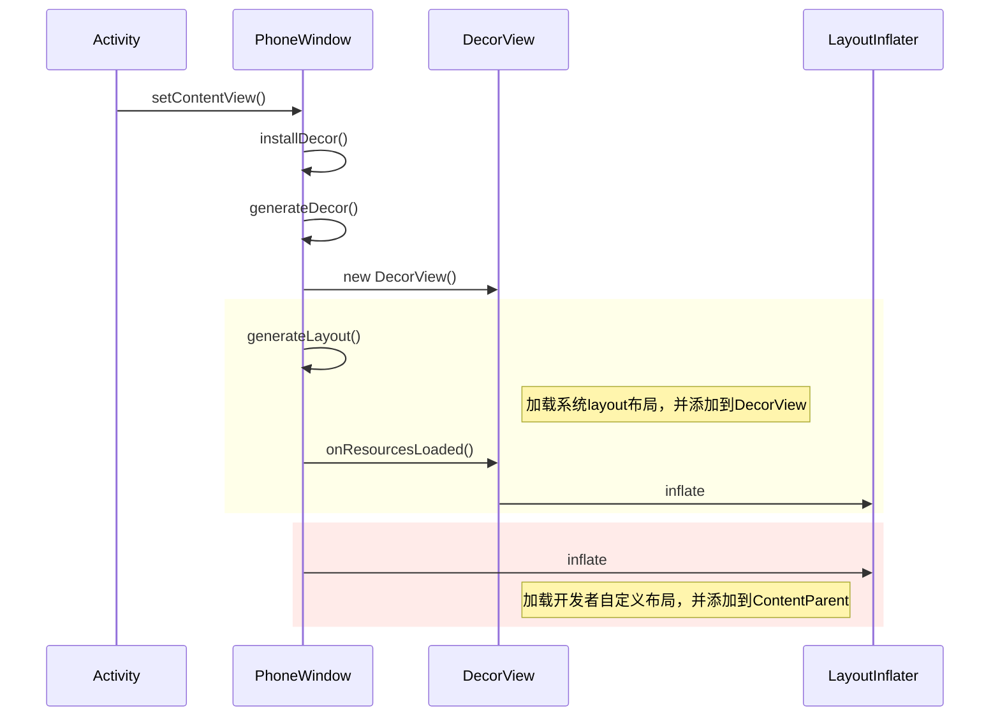
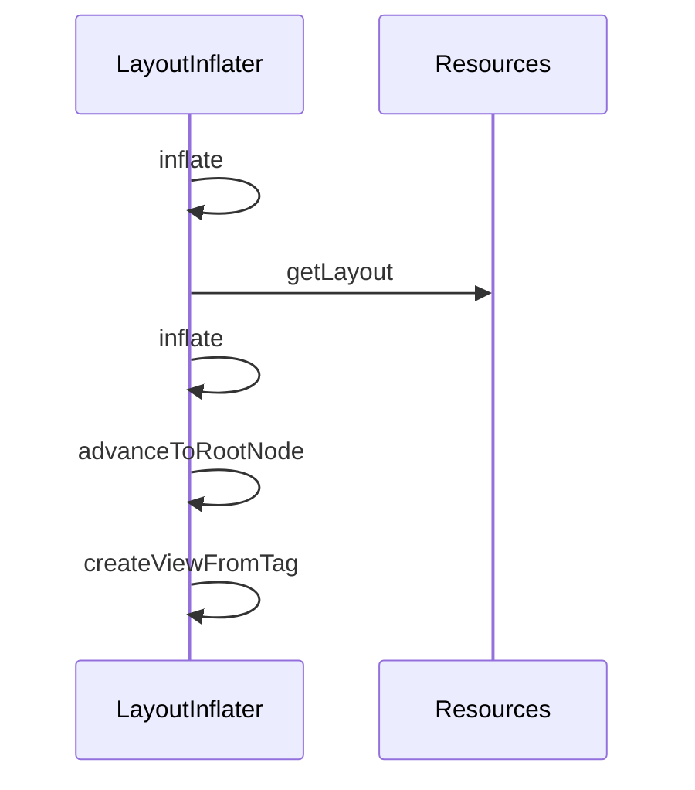

# setContentView源码解析

## setContentView 分析

主要功能是在Window中建立整个View视图层级，并没有开始渲染绘制View

整体流程

1. 创建decorView

2. 根据主题加载系统的layout文件，并将其添加到DecorView中

3. 创建ContentParent View, 即android.R.id.content

4. 加载开发者自定义的layout文件，并将其添加到ContentParent中

   





PhoneWindow#setContentView

```java
@Override
    public void setContentView(int layoutResID) {
        if (mContentParent == null) {
          // 1. 实例化DecorView
          //
            installDecor();
        } else if (!hasFeature(FEATURE_CONTENT_TRANSITIONS)) {
            mContentParent.removeAllViews();
        }

        if (hasFeature(FEATURE_CONTENT_TRANSITIONS)) {
            final Scene newScene = Scene.getSceneForLayout(mContentParent, layoutResID,
                    getContext());
            transitionTo(newScene);
        } else {
          // 解析布局文件，并将View添加到ContentView上
            mLayoutInflater.inflate(layoutResID, mContentParent);
        }
        mContentParent.requestApplyInsets();
        final Callback cb = getCallback();
        if (cb != null && !isDestroyed()) {
            cb.onContentChanged();
        }
        mContentParentExplicitlySet = true;
    }
```


PhoneWindow#installDecor

```java
private void installDecor() {
        mForceDecorInstall = false;
        if (mDecor == null) {
          // 实例化DecorView,将其设置为根节点
            mDecor = generateDecor(-1);
            mDecor.setDescendantFocusability(ViewGroup.FOCUS_AFTER_DESCENDANTS);
            mDecor.setIsRootNamespace(true);
            if (!mInvalidatePanelMenuPosted && mInvalidatePanelMenuFeatures != 0) {
                mDecor.postOnAnimation(mInvalidatePanelMenuRunnable);
            }
        } else {
            mDecor.setWindow(this);
        }
        if (mContentParent == null) {
            // 创建ContentParent 自定义布局的父布局 android.R.id.content获得
            mContentParent = generateLayout(mDecor);

            // Set up decor part of UI to ignore fitsSystemWindows if appropriate.
            mDecor.makeOptionalFitsSystemWindows();

            final DecorContentParent decorContentParent = (DecorContentParent) mDecor.findViewById(
                    R.id.decor_content_parent);

            if (decorContentParent != null) {
                mDecorContentParent = decorContentParent;
                mDecorContentParent.setWindowCallback(getCallback());
                if (mDecorContentParent.getTitle() == null) {
                    mDecorContentParent.setWindowTitle(mTitle);
                }

                final int localFeatures = getLocalFeatures();
                for (int i = 0; i < FEATURE_MAX; i++) {
                    if ((localFeatures & (1 << i)) != 0) {
                        mDecorContentParent.initFeature(i);
                    }
                }

                mDecorContentParent.setUiOptions(mUiOptions);

                if ((mResourcesSetFlags & FLAG_RESOURCE_SET_ICON) != 0 ||
                        (mIconRes != 0 && !mDecorContentParent.hasIcon())) {
                    mDecorContentParent.setIcon(mIconRes);
                } else if ((mResourcesSetFlags & FLAG_RESOURCE_SET_ICON) == 0 &&
                        mIconRes == 0 && !mDecorContentParent.hasIcon()) {
                    mDecorContentParent.setIcon(
                            getContext().getPackageManager().getDefaultActivityIcon());
                    mResourcesSetFlags |= FLAG_RESOURCE_SET_ICON_FALLBACK;
                }
                if ((mResourcesSetFlags & FLAG_RESOURCE_SET_LOGO) != 0 ||
                        (mLogoRes != 0 && !mDecorContentParent.hasLogo())) {
                    mDecorContentParent.setLogo(mLogoRes);
                }

                // Invalidate if the panel menu hasn't been created before this.
                // Panel menu invalidation is deferred avoiding application onCreateOptionsMenu
                // being called in the middle of onCreate or similar.
                // A pending invalidation will typically be resolved before the posted message
                // would run normally in order to satisfy instance state restoration.
                PanelFeatureState st = getPanelState(FEATURE_OPTIONS_PANEL, false);
                if (!isDestroyed() && (st == null || st.menu == null) && !mIsStartingWindow) {
                    invalidatePanelMenu(FEATURE_ACTION_BAR);
                }
            } else {
                mTitleView = findViewById(R.id.title);
                if (mTitleView != null) {
                    if ((getLocalFeatures() & (1 << FEATURE_NO_TITLE)) != 0) {
                        final View titleContainer = findViewById(R.id.title_container);
                        if (titleContainer != null) {
                            titleContainer.setVisibility(View.GONE);
                        } else {
                            mTitleView.setVisibility(View.GONE);
                        }
                        mContentParent.setForeground(null);
                    } else {
                        mTitleView.setText(mTitle);
                    }
                }
            }

            if (mDecor.getBackground() == null && mBackgroundFallbackDrawable != null) {
                mDecor.setBackgroundFallback(mBackgroundFallbackDrawable);
            }

            // Only inflate or create a new TransitionManager if the caller hasn't
            // already set a custom one.
            if (hasFeature(FEATURE_ACTIVITY_TRANSITIONS)) {
              	// 省略
            }
        }
    }
```


PhoneWindow#generateLayout

```java
protected ViewGroup generateLayout(DecorView decor) {
        // Apply data from current theme.

        // 省略

        // Inflate the window decor.
		
    	// 根据theme不同选择不同的layoutResource
        int layoutResource;
        int features = getLocalFeatures();
        // System.out.println("Features: 0x" + Integer.toHexString(features));
        if ((features & (1 << FEATURE_SWIPE_TO_DISMISS)) != 0) {
            layoutResource = R.layout.screen_swipe_dismiss;
            setCloseOnSwipeEnabled(true);
        } else if ((features & ((1 << FEATURE_LEFT_ICON) | (1 << FEATURE_RIGHT_ICON))) != 0) {
            if (mIsFloating) {
                TypedValue res = new TypedValue();
                getContext().getTheme().resolveAttribute(
                        R.attr.dialogTitleIconsDecorLayout, res, true);
                layoutResource = res.resourceId;
            } else {
                layoutResource = R.layout.screen_title_icons;
            }
            // XXX Remove this once action bar supports these features.
            removeFeature(FEATURE_ACTION_BAR);
            // System.out.println("Title Icons!");
        } else if ((features & ((1 << FEATURE_PROGRESS) | (1 << FEATURE_INDETERMINATE_PROGRESS))) != 0
                && (features & (1 << FEATURE_ACTION_BAR)) == 0) {
            // Special case for a window with only a progress bar (and title).
            // XXX Need to have a no-title version of embedded windows.
            layoutResource = R.layout.screen_progress;
            // System.out.println("Progress!");
        } else if ((features & (1 << FEATURE_CUSTOM_TITLE)) != 0) {
            // Special case for a window with a custom title.
            // If the window is floating, we need a dialog layout
            if (mIsFloating) {
                TypedValue res = new TypedValue();
                getContext().getTheme().resolveAttribute(
                        R.attr.dialogCustomTitleDecorLayout, res, true);
                layoutResource = res.resourceId;
            } else {
                layoutResource = R.layout.screen_custom_title;
            }
            // XXX Remove this once action bar supports these features.
            removeFeature(FEATURE_ACTION_BAR);
        } else if ((features & (1 << FEATURE_NO_TITLE)) == 0) {
            // If no other features and not embedded, only need a title.
            // If the window is floating, we need a dialog layout
            if (mIsFloating) {
                TypedValue res = new TypedValue();
                getContext().getTheme().resolveAttribute(
                        R.attr.dialogTitleDecorLayout, res, true);
                layoutResource = res.resourceId;
            } else if ((features & (1 << FEATURE_ACTION_BAR)) != 0) {
                layoutResource = a.getResourceId(
                        R.styleable.Window_windowActionBarFullscreenDecorLayout,
                        R.layout.screen_action_bar);
            } else {
                layoutResource = R.layout.screen_title;
            }
            // System.out.println("Title!");
        } else if ((features & (1 << FEATURE_ACTION_MODE_OVERLAY)) != 0) {
            layoutResource = R.layout.screen_simple_overlay_action_mode;
        } else {
            // Embedded, so no decoration is needed.
            layoutResource = R.layout.screen_simple;
            // System.out.println("Simple!");
        }

        mDecor.startChanging();
    	// 解析layoutResource文件，并将View添加到DecorView
        mDecor.onResourcesLoaded(mLayoutInflater, layoutResource);
		// 创建ContentParent
        ViewGroup contentParent = (ViewGroup)findViewById(ID_ANDROID_CONTENT);
        if (contentParent == null) {
            throw new RuntimeException("Window couldn't find content container view");
        }

        if ((features & (1 << FEATURE_INDETERMINATE_PROGRESS)) != 0) {
            ProgressBar progress = getCircularProgressBar(false);
            if (progress != null) {
                progress.setIndeterminate(true);
            }
        }

        if ((features & (1 << FEATURE_SWIPE_TO_DISMISS)) != 0) {
            registerSwipeCallbacks(contentParent);
        }

        // Remaining setup -- of background and title -- that only applies
        // to top-level windows.
        if (getContainer() == null) {
            mDecor.setWindowBackground(mBackgroundDrawable);

            final Drawable frame;
            if (mFrameResource != 0) {
                frame = getContext().getDrawable(mFrameResource);
            } else {
                frame = null;
            }
            mDecor.setWindowFrame(frame);

            mDecor.setElevation(mElevation);
            mDecor.setClipToOutline(mClipToOutline);

            if (mTitle != null) {
                setTitle(mTitle);
            }

            if (mTitleColor == 0) {
                mTitleColor = mTextColor;
            }
            setTitleColor(mTitleColor);
        }

        mDecor.finishChanging();

        return contentParent;
    }
```


该方法主要解析并加载系统的xml布局文件，创建ContentParent，并将ContentParent添加到DecorView.


在整个过程中，有两次都会用到LayoutInflater.inflate，它的工作过程是什么样的呢？

## LayoutInflater#inflate

整体流程

1. 解析xml文件，并加载到内存中
2. 根据tag创建layout的Root View
3. 递归创建子View
4. 将view添加到父view中




```java
public View inflate(@LayoutRes int resource, @Nullable ViewGroup root, boolean attachToRoot) {
        final Resources res = getContext().getResources();
        
		// Android 10 新增，目前还不支持
        View view = tryInflatePrecompiled(resource, res, root, attachToRoot);
        if (view != null) {
            return view;
        }
        XmlResourceParser parser = res.getLayout(resource);
        try {
            return inflate(parser, root, attachToRoot);
        } finally {
            parser.close();
        }
    }
```


```java
public View inflate(XmlPullParser parser, @Nullable ViewGroup root, boolean attachToRoot) {
        synchronized (mConstructorArgs) {
            Trace.traceBegin(Trace.TRACE_TAG_VIEW, "inflate");

            final Context inflaterContext = mContext;
            final AttributeSet attrs = Xml.asAttributeSet(parser);
            Context lastContext = (Context) mConstructorArgs[0];
            mConstructorArgs[0] = inflaterContext;
            View result = root;

            try {
                // 定位到根节点
                advanceToRootNode(parser);
                final String name = parser.getName();

               
                if (TAG_MERGE.equals(name)) {
                    // <merge>标签必须要有attach到父View节点，否则抛异常
                    if (root == null || !attachToRoot) {
                        throw new InflateException("<merge /> can be used only with a valid "
                                + "ViewGroup root and attachToRoot=true");
                    }

                    rInflate(parser, root, inflaterContext, attrs, false);
                } else {
                    // 创建layout的根节点view
                    // Temp is the root view that was found in the xml
                    final View temp = createViewFromTag(root, name, inflaterContext, attrs);

                    ViewGroup.LayoutParams params = null;

                    if (root != null) {
                        if (DEBUG) {
                            System.out.println("Creating params from root: " +
                                    root);
                        }
                        // Create layout params that match root, if supplied
                        params = root.generateLayoutParams(attrs);
                        if (!attachToRoot) {
                            // Set the layout params for temp if we are not
                            // attaching. (If we are, we use addView, below)
                            temp.setLayoutParams(params);
                        }
                    }

                    // 加载子view节点
                    // Inflate all children under temp against its context.
                    rInflateChildren(parser, temp, attrs, true);
					
                    // 添加到root view
                    // We are supposed to attach all the views we found (int temp)
                    // to root. Do that now.
                    if (root != null && attachToRoot) {
                        root.addView(temp, params);
                    }

                    // Decide whether to return the root that was passed in or the
                    // top view found in xml.
                    if (root == null || !attachToRoot) {
                        result = temp;
                    }
                }

            } catch (XmlPullParserException e) {
                final InflateException ie = new InflateException(e.getMessage(), e);
                ie.setStackTrace(EMPTY_STACK_TRACE);
                throw ie;
            } catch (Exception e) {
                final InflateException ie = new InflateException(
                        getParserStateDescription(inflaterContext, attrs)
                        + ": " + e.getMessage(), e);
                ie.setStackTrace(EMPTY_STACK_TRACE);
                throw ie;
            } finally {
                // Don't retain static reference on context.
                mConstructorArgs[0] = lastContext;
                mConstructorArgs[1] = null;

                Trace.traceEnd(Trace.TRACE_TAG_VIEW);
            }

            return result;
        }
    }
```


```java
View createViewFromTag(View parent, String name, Context context, AttributeSet attrs,
            boolean ignoreThemeAttr) {
        if (name.equals("view")) {
            name = attrs.getAttributeValue(null, "class");
        }

        // Apply a theme wrapper, if allowed and one is specified.
        if (!ignoreThemeAttr) {
            final TypedArray ta = context.obtainStyledAttributes(attrs, ATTRS_THEME);
            final int themeResId = ta.getResourceId(0, 0);
            if (themeResId != 0) {
                context = new ContextThemeWrapper(context, themeResId);
            }
            ta.recycle();
        }

        try {
            View view = tryCreateView(parent, name, context, attrs);

            if (view == null) {
                final Object lastContext = mConstructorArgs[0];
                mConstructorArgs[0] = context;
                try {
                    if (-1 == name.indexOf('.')) {
                        view = onCreateView(context, parent, name, attrs);
                    } else {
                        view = createView(context, name, null, attrs);
                    }
                } finally {
                    mConstructorArgs[0] = lastContext;
                }
            }

            return view;
        } catch (InflateException e) {
          // ...
        }
    }
```


```java
public final View tryCreateView(@Nullable View parent, @NonNull String name,
        @NonNull Context context,
        @NonNull AttributeSet attrs) {
        if (name.equals(TAG_1995)) {
            // Let's party like it's 1995!
            return new BlinkLayout(context, attrs);
        }

        View view;
    	// 开发者可以自己实现Factory#onCreateView hook系统的view
        if (mFactory2 != null) {
            view = mFactory2.onCreateView(parent, name, context, attrs);
        } else if (mFactory != null) {
            view = mFactory.onCreateView(name, context, attrs);
        } else {
            view = null;
        }
		// 走系统默认的，对于fragment，会走Activity中onCreateView,其他的还是返回null,由LayoutInflater#createView创建
        if (view == null && mPrivateFactory != null) {
            view = mPrivateFactory.onCreateView(parent, name, context, attrs);
        }

        return view;
    }
```


真正的创建view是通过Factory#onCreateView方法。优先使用开发者自定义的Factory#onCreateView，如果没有，则使用默认的onCreateView


通过反射实例化view

```java
 @Nullable
    public final View createView(@NonNull Context viewContext, @NonNull String name,
            @Nullable String prefix, @Nullable AttributeSet attrs)
            throws ClassNotFoundException, InflateException {
        Objects.requireNonNull(viewContext);
        Objects.requireNonNull(name);
        Constructor<? extends View> constructor = sConstructorMap.get(name);
        if (constructor != null && !verifyClassLoader(constructor)) {
            constructor = null;
            sConstructorMap.remove(name);
        }
        Class<? extends View> clazz = null;

        try {
            Trace.traceBegin(Trace.TRACE_TAG_VIEW, name);

            if (constructor == null) {
                // Class not found in the cache, see if it's real, and try to add it
                clazz = Class.forName(prefix != null ? (prefix + name) : name, false,
                        mContext.getClassLoader()).asSubclass(View.class);

                if (mFilter != null && clazz != null) {
                    boolean allowed = mFilter.onLoadClass(clazz);
                    if (!allowed) {
                        failNotAllowed(name, prefix, viewContext, attrs);
                    }
                }
                constructor = clazz.getConstructor(mConstructorSignature);
                constructor.setAccessible(true);
                sConstructorMap.put(name, constructor);
            } else {
                // If we have a filter, apply it to cached constructor
                if (mFilter != null) {
                    // Have we seen this name before?
                    Boolean allowedState = mFilterMap.get(name);
                    if (allowedState == null) {
                        // New class -- remember whether it is allowed
                        clazz = Class.forName(prefix != null ? (prefix + name) : name, false,
                                mContext.getClassLoader()).asSubclass(View.class);

                        boolean allowed = clazz != null && mFilter.onLoadClass(clazz);
                        mFilterMap.put(name, allowed);
                        if (!allowed) {
                            failNotAllowed(name, prefix, viewContext, attrs);
                        }
                    } else if (allowedState.equals(Boolean.FALSE)) {
                        failNotAllowed(name, prefix, viewContext, attrs);
                    }
                }
            }

            Object lastContext = mConstructorArgs[0];
            mConstructorArgs[0] = viewContext;
            Object[] args = mConstructorArgs;
            args[1] = attrs;

            try {
                final View view = constructor.newInstance(args);
                if (view instanceof ViewStub) {
                    // Use the same context when inflating ViewStub later.
                    final ViewStub viewStub = (ViewStub) view;
                    viewStub.setLayoutInflater(cloneInContext((Context) args[0]));
                }
                return view;
            } finally {
                mConstructorArgs[0] = lastContext;
            }
        } catch (NoSuchMethodException e) {
            final InflateException ie = new InflateException(
                    getParserStateDescription(viewContext, attrs)
                    + ": Error inflating class " + (prefix != null ? (prefix + name) : name), e);
            ie.setStackTrace(EMPTY_STACK_TRACE);
            throw ie;

        } catch (ClassCastException e) {
            // If loaded class is not a View subclass
            final InflateException ie = new InflateException(
                    getParserStateDescription(viewContext, attrs)
                    + ": Class is not a View " + (prefix != null ? (prefix + name) : name), e);
            ie.setStackTrace(EMPTY_STACK_TRACE);
            throw ie;
        } catch (ClassNotFoundException e) {
            // If loadClass fails, we should propagate the exception.
            throw e;
        } catch (Exception e) {
            final InflateException ie = new InflateException(
                    getParserStateDescription(viewContext, attrs) + ": Error inflating class "
                            + (clazz == null ? "<unknown>" : clazz.getName()), e);
            ie.setStackTrace(EMPTY_STACK_TRACE);
            throw ie;
        } finally {
            Trace.traceEnd(Trace.TRACE_TAG_VIEW);
        }
    }
```

