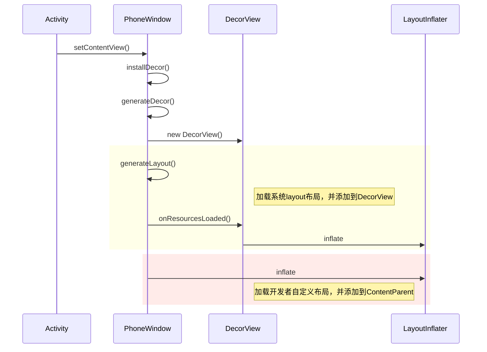

# setContentView耗时分析

```
setContentView 

	if mContentParent == null
		installDecor()

	mLayoutInflater.inflate(layoutResID, mContentParent)


installDecor()


```


​	


setContentView主要是有两个操作，installDecor()和LayoutInflater.inflate()。

通过tracer文件分析，setContentView 最耗时的方法有两个，`PhoneWindow#installDecor()`和`LayoutInflate.inflate`方法。


[图片上传失败...(image-cf1f7b-1600756462201)]


## installDecor耗时分析

installDecor会实例化DecorView，然后解析系统
的layout xml文件，将

最耗时的方法有两个：`PhoneWindow#generateLayout`和`PhoneWindow#generateDecor()`

进一步分析这两个方法做了哪些事情，什么逻辑占用cpu时间较长。

### `PhoneWindow#generateDecor()`

该方法主要是实例化DecorView对象。从tracer分析截图可以看出，最耗时逻辑在DecorView 的构造方法时，会解析并加载xml资源文件。


跟踪到DecorView的构造方法中，会加载`android.R.interpolator.linear_out_slow_in`和`android.R.interpolator.fast_out_linear_in`两个资源文件。

```java
 DecorView(Context context, int featureId, PhoneWindow window,
            WindowManager.LayoutParams params) {
        super(context);
        mFeatureId = featureId;
		// 加载动画插值器
        mShowInterpolator = AnimationUtils.loadInterpolator(context,
                android.R.interpolator.linear_out_slow_in);
        mHideInterpolator = AnimationUtils.loadInterpolator(context,
                android.R.interpolator.fast_out_linear_in);

        // 省略
    }
```

TODO 分析上面两个资源文件是做什么用的。

### `PhoneWindow#generateLayout`

该方法主要解析并加载系统的xml布局文件，创建ContentParent，并将ContentParent添加到DecorView.

主要耗时操作是`LayoutInflater.inflate`

## LayoutInflater.inflate()

从上面可以看出，installDecor本质上的耗时逻辑也是在`LayoutInflater.inflate`方法。

inflate整体流程

1. **解析xml文件，并加载到内存中 `res.getLayout(resource)`**
2. **根据tag创建layout的Root View (通过反射)**
3. **递归创建子View  （通过反射）**
4. 将view添加到父view中


在上面的流程中，

1. 读取、解析xml文件到内存，在UI线程做io操作，比较耗时
2. 根据tag 名称反射加载相应的view，比较耗时


​        

```java
public View inflate(@LayoutRes int resource, @Nullable ViewGroup root, boolean attachToRoot) {
        final Resources res = getContext().getResources();
        
		// Android 10 新增，目前还不支持
        View view = tryInflatePrecompiled(resource, res, root, attachToRoot);
        if (view != null) {
            return view;
        }
    	// 读取、解析xml文件到内存，属于io操作
        XmlResourceParser parser = res.getLayout(resource);
        try {
            return inflate(parser, root, attachToRoot);
        } finally {
            parser.close();
        }
    }
```


##  setContentView耗时分析

### setContentView 整体流程



1. 如果DecorView 为空，实例化DecorView，并将DecorView与Window关联
2. 如果mContentParent为空，根据theme，inflate系统layout xml，并将该view添加到DecorView上。mContentParent是指的id为content的FrameLayout，它是开发者自定义view的父view。
3. inflate 自定义layout xml文件

通过分析trace文件，setContentView主要时间消耗在两次inflate过程中。下面进一步分析inflate的逻辑

### inflate 过程

1. 解析xml文件，并加载到内存（IO）
2. 定位到xml文件根节点，根据tag名称，先创建父view，然后递归创建子view。（反射）

从上面可以看出，setContentView 的真正耗时逻辑是inflate view的过程

1. **解析xml文件，并加载到内存（IO）**
2. **定位到xml文件根节点**
3. 根据tag名称创建根节点view
4. 递归创建子view 
5. 将根节点view添加到ContentParent上

不管是创建根节点view还是子view，都是通过LayoutInflater#createViewFromTag()方法。下面继续分析根据tag创建view的逻辑。

createViewFromTag 逻辑很简单，首先调用tryCreateView方法，然后判断view是否为null，如果为null，最终会调用createView方法。

LayoutInflater#createViewFromTag

```java
View createViewFromTag(View parent, String name, Context context, AttributeSet attrs,
            boolean ignoreThemeAttr) {
        // 省略
        try {
            View view = tryCreateView(parent, name, context, attrs);

            if (view == null) {
                final Object lastContext = mConstructorArgs[0];
                mConstructorArgs[0] = context;
                try {
                    if (-1 == name.indexOf('.')) {
                        view = onCreateView(context, parent, name, attrs);
                    } else {
                        view = createView(context, name, null, attrs);
                    }
                } finally {
                    mConstructorArgs[0] = lastContext;
                }
            }

            return view;
        } catch (InflateException e) {
          // ...
        }
    }
```

继续看tryCreateView方法中做了哪些事情。

1. 先判断开发者是否自己实现Factory接口，如果实现了接口，就走开发者自定义的创建view的逻辑。
2. 如果没有实现接口，进一步判断`mPrivateFactory`是否为null，如果不空的话，走系统默认的，对于fragment，会走Activity中onCreateView，其他的还是返回null，最终还是由LayoutInflater#createView方法创建view。

LayoutInflater#tryCreateView

```java
public final View tryCreateView(@Nullable View parent, @NonNull String name,
        @NonNull Context context,
        @NonNull AttributeSet attrs) {
        if (name.equals(TAG_1995)) {
            // Let's party like it's 1995!
            return new BlinkLayout(context, attrs);
        }

        View view;
    	// 开发者可以自己实现Factory#onCreateView hook系统的view
        if (mFactory2 != null) {
            view = mFactory2.onCreateView(parent, name, context, attrs);
        } else if (mFactory != null) {
            view = mFactory.onCreateView(name, context, attrs);
        } else {
            view = null;
        }
		// 走系统默认的，对于fragment，会走Activity中onCreateView,其他的还是返回null,由LayoutInflater#createView创建
        if (view == null && mPrivateFactory != null) {
            view = mPrivateFactory.onCreateView(parent, name, context, attrs);
        }

        return view;
    }
```

LayoutInflater#createView

该方法主要是根据tag名称，通过反射创建view。

```java
@Nullable
    public final View createView(@NonNull Context viewContext, @NonNull String name,
            @Nullable String prefix, @Nullable AttributeSet attrs)
            throws ClassNotFoundException, InflateException {
        Objects.requireNonNull(viewContext);
        Objects.requireNonNull(name);
        Constructor<? extends View> constructor = sConstructorMap.get(name);
        if (constructor != null && !verifyClassLoader(constructor)) {
            constructor = null;
            sConstructorMap.remove(name);
        }
        Class<? extends View> clazz = null;

        try {
            Trace.traceBegin(Trace.TRACE_TAG_VIEW, name);

            if (constructor == null) {
                // Class not found in the cache, see if it's real, and try to add it
                clazz = Class.forName(prefix != null ? (prefix + name) : name, false,
                        mContext.getClassLoader()).asSubclass(View.class);

                if (mFilter != null && clazz != null) {
                    boolean allowed = mFilter.onLoadClass(clazz);
                    if (!allowed) {
                        failNotAllowed(name, prefix, viewContext, attrs);
                    }
                }
                constructor = clazz.getConstructor(mConstructorSignature);
                constructor.setAccessible(true);
                sConstructorMap.put(name, constructor);
            } else {
                // If we have a filter, apply it to cached constructor
                if (mFilter != null) {
                    // Have we seen this name before?
                    Boolean allowedState = mFilterMap.get(name);
                    if (allowedState == null) {
                        // New class -- remember whether it is allowed
                        clazz = Class.forName(prefix != null ? (prefix + name) : name, false,
                                mContext.getClassLoader()).asSubclass(View.class);

                        boolean allowed = clazz != null && mFilter.onLoadClass(clazz);
                        mFilterMap.put(name, allowed);
                        if (!allowed) {
                            failNotAllowed(name, prefix, viewContext, attrs);
                        }
                    } else if (allowedState.equals(Boolean.FALSE)) {
                        failNotAllowed(name, prefix, viewContext, attrs);
                    }
                }
            }

            Object lastContext = mConstructorArgs[0];
            mConstructorArgs[0] = viewContext;
            Object[] args = mConstructorArgs;
            args[1] = attrs;

            try {
                final View view = constructor.newInstance(args);
                if (view instanceof ViewStub) {
                    // Use the same context when inflating ViewStub later.
                    final ViewStub viewStub = (ViewStub) view;
                    viewStub.setLayoutInflater(cloneInContext((Context) args[0]));
                }
                return view;
            } finally {
                mConstructorArgs[0] = lastContext;
            }
        } catch (NoSuchMethodException e) {
            // 省略
        }
    }
```


### setContent耗时逻辑

耗时逻辑主要有两部分

1.  将xml文件解析并加载到内存。属于IO操作
2. 通过反射创建view

### 优化方案

方案1

将xml文件转换成JAVA代码，可以去掉解析xml和反射加载view的过程

优点：可以去点解析xml和反射创建view的过程

缺点：后面不好维护，可读性差


方案2

自定义Factory，在onCreateView中实例化view，可以去掉反射加载的过程


### 梳理SwanAppActivity中加载的xml文件

aiapps_activity.xml

aiapps_fragment.xml

aiapps_actionbar.xml

aiapps_action_bar.xml

aiapps_action_bar_right_menu.xml

aiapps_bottom_tab_icon.xml


[X2C 框架](https://github.com/iReaderAndroid/X2C)：将xml转成JAVA框架

