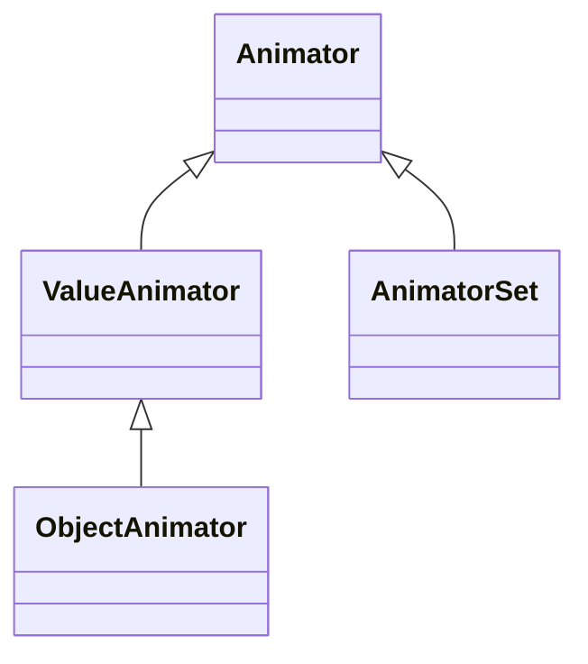

# 属性动画

```mermaid
classDiagram
	class Animator{
	
	}
	
	class ValueAnimator{
	
	}
	
	class AnimatorSet {
	
	}
	
	class ObjectAnimator{
	
	}
	Animator <|-- ValueAnimator
	Animator <|-- AnimatorSet
	ValueAnimator <|-- ObjectAnimator
	
	
```

