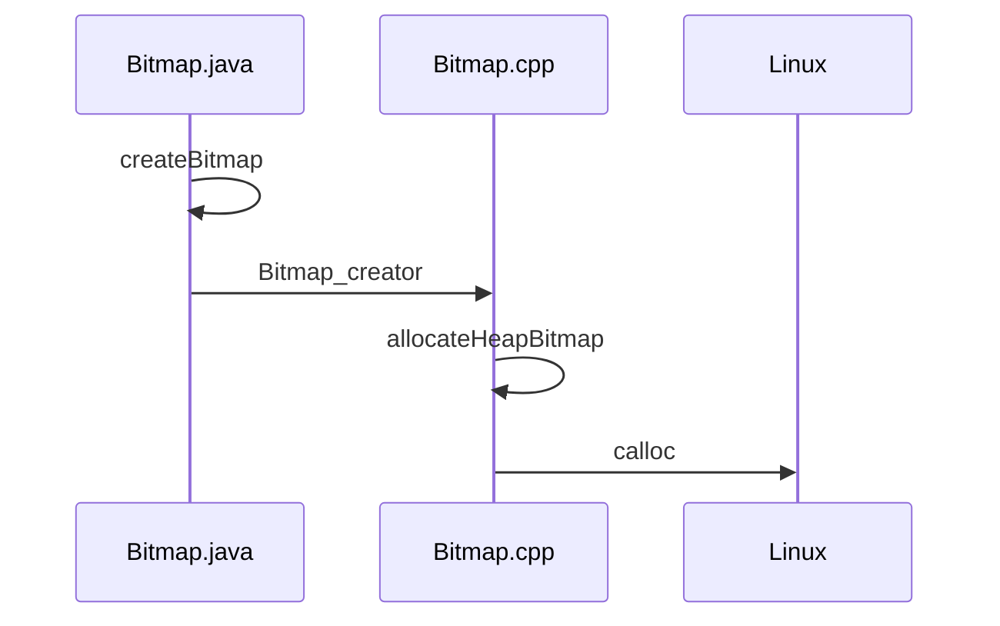

# Bitmap内存分配原理

Android 8.0之前，bitmap像素数据保存在java heap

Android 8.0之后，bitmap像素数据保存在native heap

```mermaid
sequenceDiagram 
	Bitmap.java ->> Bitmap.java:createBitmap
	Bitmap.java ->> Bitmap.cpp:Bitmap_creator
	Bitmap.cpp ->> Bitmap.cpp:allocateHeapBitmap

	Bitmap.cpp ->> Linux:calloc
```

