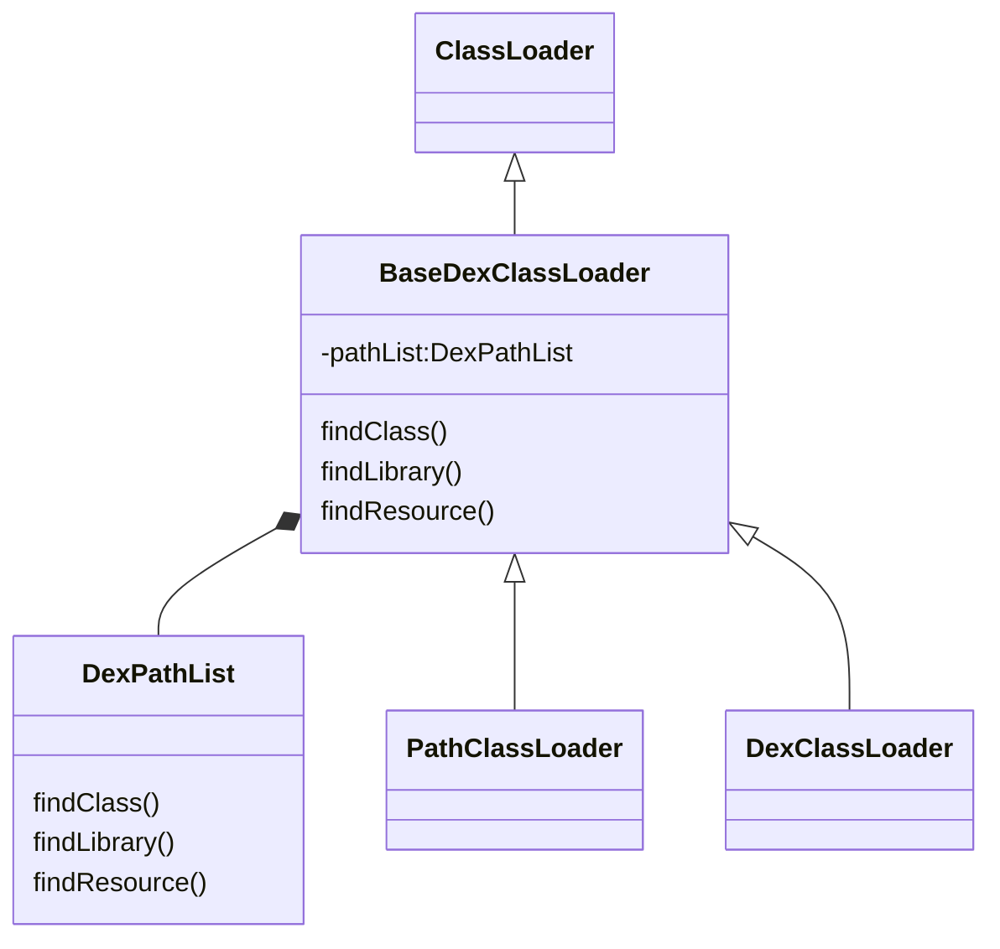

# 热修复实现原理

热修复的原理：在打包时，通过插桩的方式预先埋点。线上遇到问题时，打patch包（dex文件）。下发patch后，使用dexClassLoader加载dex文件，并将其放入到pathDexList的前面。先加载已修复的class。

## Android ClassLoader

Android有自己的classloader将类加载到内存之中。与JAVA不同的是，Android不是直接加载class文件，而是加载dex文件。

- PathClassLoader 

只能加载已安装的apk文件（/data/app目录），是系统默认的类加载器

- DexClassLoader

可以加载任意目录下的dex/jar/apk/zip文件，比PathClassLoader更灵活，是实现热修复的重点。

### 加载过程

1. 根据dex的路径读取dex文件，并将dex解析城Element对象，一个dex文件对应一个Element
2. 如果有多个dex，会将其添加到Element数组中
3. 遍历Element数组，根据类名找到指定类

## 热修复实现原理

### 插桩

1. Javassist, 一种字节码操作工具

- 关键类名:ClassPool, CtClass, CtMethod, CtField
- Javassist 介绍的比较全的文章: [Javassist 使用指南一](https://www.jianshu.com/p/43424242846b), [Javassist 使用指南（二）](https://www.jianshu.com/p/b9b3ff0e1bf8), [Javassist 使用指南（三）](https://www.jianshu.com/p/7803ffcc81c8). 重点查看Javassist 使用的内容: 定义新类、类的冻结和解冻、添加类的搜索路径、CtClass 到Class (CtClass.toClass())、添加新方法、添加新字段、修改方法体、删除成员、注解、导入新包相关、修改类、方法或者变量的修饰符
- 结合gradle 插件，Transform API, Javassist 的文章 [Android动态编译技术:Plugin Transform Javassist操作Class文件](https://blog.csdn.net/yulong0809/article/details/77752098)

2. ASM 也是一种字节码操作工具，相比Javassist 的API更难用，但效率更高。

- 关键词 ClassVistor, MethodVistor, Opcodes
- 主要查看内容: 1. 修改类、字段、方法的名字或修饰符；2. 增加新的类、方法、字段; 3. 更改类、方法或者变量的修饰符 (ClassVistor 中的visitField(), visitMethod(), )
- 方法中的 signature、descriptor区别。参考文章: [方法字节码signature和descriptor的区别](https://blog.csdn.net/reliveIT/article/details/51163403)。 
- 参考文章： [AOP 的利器：ASM 3.0 介绍](https://www.ibm.com/developerworks/cn/java/j-lo-asm30/index.html), [增加字节码往方法体内插代码](

