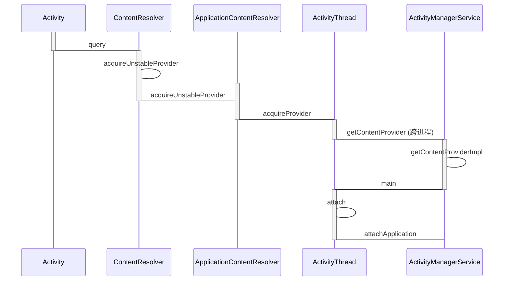
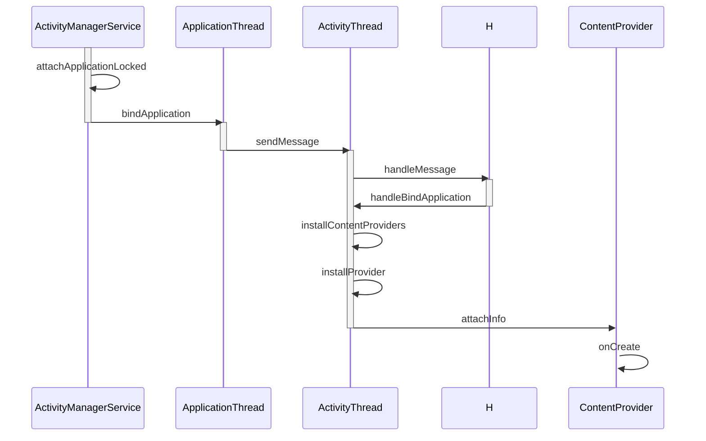

# ContentProvider 启动过程


**frameworks/base/core/Java/android/content/ContextWrapper.java**

```java
    @Override
    public ContentResolver getContentResolver() {
        return mBase.getContentResolver();
    }
```


**frameworks/base/core/java/android/app/ContextImpl.java**

```java
  @Override
    public ContentResolver getContentResolver() {
        return mContentResolver;
    }
```





**frameworks/base/core/java/android/content/ContentResolver.java**

```java
public final @Nullable Cursor query(final @RequiresPermission.Read @NonNull Uri uri,
            @Nullable String[] projection, @Nullable Bundle queryArgs,
            @Nullable CancellationSignal cancellationSignal) {
        Preconditions.checkNotNull(uri, "uri");
        IContentProvider unstableProvider = acquireUnstableProvider(uri);
        if (unstableProvider == null) {
            return null;
        }
        IContentProvider stableProvider = null;
        Cursor qCursor = null;
        try {
            long startTime = SystemClock.uptimeMillis();

            ICancellationSignal remoteCancellationSignal = null;
            if (cancellationSignal != null) {
                cancellationSignal.throwIfCanceled();
                remoteCancellationSignal = unstableProvider.createCancellationSignal();
                cancellationSignal.setRemote(remoteCancellationSignal);
            }
            try {
                qCursor = unstableProvider.query(mPackageName, uri, projection,
                        queryArgs, remoteCancellationSignal);
            } catch (DeadObjectException e) {
                // The remote process has died...  but we only hold an unstable
                // reference though, so we might recover!!!  Let's try!!!!
                // This is exciting!!1!!1!!!!1
                unstableProviderDied(unstableProvider);
                stableProvider = acquireProvider(uri);
                if (stableProvider == null) {
                    return null;
                }
                qCursor = stableProvider.query(
                        mPackageName, uri, projection, queryArgs, remoteCancellationSignal);
            }
            if (qCursor == null) {
                return null;
            }

            // Force query execution.  Might fail and throw a runtime exception here.
            qCursor.getCount();
            long durationMillis = SystemClock.uptimeMillis() - startTime;
            maybeLogQueryToEventLog(durationMillis, uri, projection, queryArgs);

            // Wrap the cursor object into CursorWrapperInner object.
            final IContentProvider provider = (stableProvider != null) ? stableProvider
                    : acquireProvider(uri);
            final CursorWrapperInner wrapper = new CursorWrapperInner(qCursor, provider);
            stableProvider = null;
            qCursor = null;
            return wrapper;
        } catch (RemoteException e) {
            // Arbitrary and not worth documenting, as Activity
            // Manager will kill this process shortly anyway.
            return null;
        } finally {
            if (qCursor != null) {
                qCursor.close();
            }
            if (cancellationSignal != null) {
                cancellationSignal.setRemote(null);
            }
            if (unstableProvider != null) {
                releaseUnstableProvider(unstableProvider);
            }
            if (stableProvider != null) {
                releaseProvider(stableProvider);
            }
        }
    }
```


```java
  public final IContentProvider acquireUnstableProvider(Uri uri) {
        if (!SCHEME_CONTENT.equals(uri.getScheme())) {
            return null;
        }
        String auth = uri.getAuthority();
        if (auth != null) {
            return acquireUnstableProvider(mContext, uri.getAuthority());
        }
        return null;
    }
```


**frameworks/base/core/java/android/app/ContextImpl.java**

```java
 @Override
        protected IContentProvider acquireUnstableProvider(Context c, String auth) {
            return mMainThread.acquireProvider(c,
                    ContentProvider.getAuthorityWithoutUserId(auth),
                    resolveUserIdFromAuthority(auth), false);
        }

```


**frameworks/base/core/java/android/app/ActivityThread.java**

```java
 public final IContentProvider acquireProvider(
            Context c, String auth, int userId, boolean stable) {
        final IContentProvider provider = acquireExistingProvider(c, auth, userId, stable);
        if (provider != null) {
            return provider;
        }

        // There is a possible race here.  Another thread may try to acquire
        // the same provider at the same time.  When this happens, we want to ensure
        // that the first one wins.
        // Note that we cannot hold the lock while acquiring and installing the
        // provider since it might take a long time to run and it could also potentially
        // be re-entrant in the case where the provider is in the same process.
        ContentProviderHolder holder = null;
        try {
            holder = ActivityManager.getService().getContentProvider(
                    getApplicationThread(), auth, userId, stable);
        } catch (RemoteException ex) {
            throw ex.rethrowFromSystemServer();
        }
        if (holder == null) {
            Slog.e(TAG, "Failed to find provider info for " + auth);
            return null;
        }

        // Install provider will increment the reference count for us, and break
        // any ties in the race.
        holder = installProvider(c, holder, holder.info,
                true /*noisy*/, holder.noReleaseNeeded, stable);
        return holder.provider;
    }
```


**frameworks/base/services/core/java/com/android/server/am/ActivityManagerService.java**

```java
@Override
    public final ContentProviderHolder getContentProvider(
            IApplicationThread caller, String name, int userId, boolean stable) {
        enforceNotIsolatedCaller("getContentProvider");
        if (caller == null) {
            String msg = "null IApplicationThread when getting content provider "
                    + name;
            Slog.w(TAG, msg);
            throw new SecurityException(msg);
        }
        // The incoming user check is now handled in checkContentProviderPermissionLocked() to deal
        // with cross-user grant.
        return getContentProviderImpl(caller, name, null, stable, userId);
    }
```


```java

    private ContentProviderHolder getContentProviderImpl(IApplicationThread caller,
            String name, IBinder token, boolean stable, int userId) {
        ContentProviderRecord cpr;
        ContentProviderConnection conn = null;
        ProviderInfo cpi = null;

        synchronized(this) {
            long startTime = SystemClock.uptimeMillis();

            ProcessRecord r = null;
            if (caller != null) {
                r = getRecordForAppLocked(caller);
                if (r == null) {
                    throw new SecurityException(
                            "Unable to find app for caller " + caller
                          + " (pid=" + Binder.getCallingPid()
                          + ") when getting content provider " + name);
                }
            }

            boolean checkCrossUser = true;

            checkTime(startTime, "getContentProviderImpl: getProviderByName");

            // First check if this content provider has been published...
            cpr = mProviderMap.getProviderByName(name, userId);
            // If that didn't work, check if it exists for user 0 and then
            // verify that it's a singleton provider before using it.
            if (cpr == null && userId != UserHandle.USER_SYSTEM) {
                cpr = mProviderMap.getProviderByName(name, UserHandle.USER_SYSTEM);
                if (cpr != null) {
                    cpi = cpr.info;
                    if (isSingleton(cpi.processName, cpi.applicationInfo,
                            cpi.name, cpi.flags)
                            && isValidSingletonCall(r.uid, cpi.applicationInfo.uid)) {
                        userId = UserHandle.USER_SYSTEM;
                        checkCrossUser = false;
                    } else {
                        cpr = null;
                        cpi = null;
                    }
                }
            }

            boolean providerRunning = cpr != null && cpr.proc != null && !cpr.proc.killed;
            if (providerRunning) {
                cpi = cpr.info;
                String msg;
                checkTime(startTime, "getContentProviderImpl: before checkContentProviderPermission");
                if ((msg = checkContentProviderPermissionLocked(cpi, r, userId, checkCrossUser))
                        != null) {
                    throw new SecurityException(msg);
                }
                checkTime(startTime, "getContentProviderImpl: after checkContentProviderPermission");

                if (r != null && cpr.canRunHere(r)) {
                    // This provider has been published or is in the process
                    // of being published...  but it is also allowed to run
                    // in the caller's process, so don't make a connection
                    // and just let the caller instantiate its own instance.
                    ContentProviderHolder holder = cpr.newHolder(null);
                    // don't give caller the provider object, it needs
                    // to make its own.
                    holder.provider = null;
                    return holder;
                }
                // Don't expose providers between normal apps and instant apps
                try {
                    if (AppGlobals.getPackageManager()
                            .resolveContentProvider(name, 0 /*flags*/, userId) == null) {
                        return null;
                    }
                } catch (RemoteException e) {
                }

                final long origId = Binder.clearCallingIdentity();

                checkTime(startTime, "getContentProviderImpl: incProviderCountLocked");

                // In this case the provider instance already exists, so we can
                // return it right away.
                conn = incProviderCountLocked(r, cpr, token, stable);
                if (conn != null && (conn.stableCount+conn.unstableCount) == 1) {
                    if (cpr.proc != null && r.setAdj <= ProcessList.PERCEPTIBLE_APP_ADJ) {
                        // If this is a perceptible app accessing the provider,
                        // make sure to count it as being accessed and thus
                        // back up on the LRU list.  This is good because
                        // content providers are often expensive to start.
                        checkTime(startTime, "getContentProviderImpl: before updateLruProcess");
                        updateLruProcessLocked(cpr.proc, false, null);
                        checkTime(startTime, "getContentProviderImpl: after updateLruProcess");
                    }
                }

                checkTime(startTime, "getContentProviderImpl: before updateOomAdj");
                final int verifiedAdj = cpr.proc.verifiedAdj;
                boolean success = updateOomAdjLocked(cpr.proc, true);
                // XXX things have changed so updateOomAdjLocked doesn't actually tell us
                // if the process has been successfully adjusted.  So to reduce races with
                // it, we will check whether the process still exists.  Note that this doesn't
                // completely get rid of races with LMK killing the process, but should make
                // them much smaller.
                if (success && verifiedAdj != cpr.proc.setAdj && !isProcessAliveLocked(cpr.proc)) {
                    success = false;
                }
                maybeUpdateProviderUsageStatsLocked(r, cpr.info.packageName, name);
                checkTime(startTime, "getContentProviderImpl: after updateOomAdj");
                if (DEBUG_PROVIDER) Slog.i(TAG_PROVIDER, "Adjust success: " + success);
                // NOTE: there is still a race here where a signal could be
                // pending on the process even though we managed to update its
                // adj level.  Not sure what to do about this, but at least
                // the race is now smaller.
                if (!success) {
                    // Uh oh...  it looks like the provider's process
                    // has been killed on us.  We need to wait for a new
                    // process to be started, and make sure its death
                    // doesn't kill our process.
                    Slog.i(TAG, "Existing provider " + cpr.name.flattenToShortString()
                            + " is crashing; detaching " + r);
                    boolean lastRef = decProviderCountLocked(conn, cpr, token, stable);
                    checkTime(startTime, "getContentProviderImpl: before appDied");
                    appDiedLocked(cpr.proc);
                    checkTime(startTime, "getContentProviderImpl: after appDied");
                    if (!lastRef) {
                        // This wasn't the last ref our process had on
                        // the provider...  we have now been killed, bail.
                        return null;
                    }
                    providerRunning = false;
                    conn = null;
                } else {
                    cpr.proc.verifiedAdj = cpr.proc.setAdj;
                }

                Binder.restoreCallingIdentity(origId);
            }

            if (!providerRunning) {
                try {
                    checkTime(startTime, "getContentProviderImpl: before resolveContentProvider");
                    cpi = AppGlobals.getPackageManager().
                        resolveContentProvider(name,
                            STOCK_PM_FLAGS | PackageManager.GET_URI_PERMISSION_PATTERNS, userId);
                    checkTime(startTime, "getContentProviderImpl: after resolveContentProvider");
                } catch (RemoteException ex) {
                }
                if (cpi == null) {
                    return null;
                }
                // If the provider is a singleton AND
                // (it's a call within the same user || the provider is a
                // privileged app)
                // Then allow connecting to the singleton provider
                boolean singleton = isSingleton(cpi.processName, cpi.applicationInfo,
                        cpi.name, cpi.flags)
                        && isValidSingletonCall(r.uid, cpi.applicationInfo.uid);
                if (singleton) {
                    userId = UserHandle.USER_SYSTEM;
                }
                cpi.applicationInfo = getAppInfoForUser(cpi.applicationInfo, userId);
                checkTime(startTime, "getContentProviderImpl: got app info for user");

                String msg;
                checkTime(startTime, "getContentProviderImpl: before checkContentProviderPermission");
                if ((msg = checkContentProviderPermissionLocked(cpi, r, userId, !singleton))
                        != null) {
                    throw new SecurityException(msg);
                }
                checkTime(startTime, "getContentProviderImpl: after checkContentProviderPermission");

                if (!mProcessesReady
                        && !cpi.processName.equals("system")) {
                    // If this content provider does not run in the system
                    // process, and the system is not yet ready to run other
                    // processes, then fail fast instead of hanging.
                    throw new IllegalArgumentException(
                            "Attempt to launch content provider before system ready");
                }

                // Make sure that the user who owns this provider is running.  If not,
                // we don't want to allow it to run.
                if (!mUserController.isUserRunningLocked(userId, 0)) {
                    Slog.w(TAG, "Unable to launch app "
                            + cpi.applicationInfo.packageName + "/"
                            + cpi.applicationInfo.uid + " for provider "
                            + name + ": user " + userId + " is stopped");
                    return null;
                }

                ComponentName comp = new ComponentName(cpi.packageName, cpi.name);
                checkTime(startTime, "getContentProviderImpl: before getProviderByClass");
                cpr = mProviderMap.getProviderByClass(comp, userId);
                checkTime(startTime, "getContentProviderImpl: after getProviderByClass");
                final boolean firstClass = cpr == null;
                if (firstClass) {
                    final long ident = Binder.clearCallingIdentity();

                    // If permissions need a review before any of the app components can run,
                    // we return no provider and launch a review activity if the calling app
                    // is in the foreground.
                    if (mPermissionReviewRequired) {
                        if (!requestTargetProviderPermissionsReviewIfNeededLocked(cpi, r, userId)) {
                            return null;
                        }
                    }

                    try {
                        checkTime(startTime, "getContentProviderImpl: before getApplicationInfo");
                        ApplicationInfo ai =
                            AppGlobals.getPackageManager().
                                getApplicationInfo(
                                        cpi.applicationInfo.packageName,
                                        STOCK_PM_FLAGS, userId);
                        checkTime(startTime, "getContentProviderImpl: after getApplicationInfo");
                        if (ai == null) {
                            Slog.w(TAG, "No package info for content provider "
                                    + cpi.name);
                            return null;
                        }
                        ai = getAppInfoForUser(ai, userId);
                        cpr = new ContentProviderRecord(this, cpi, ai, comp, singleton);
                    } catch (RemoteException ex) {
                        // pm is in same process, this will never happen.
                    } finally {
                        Binder.restoreCallingIdentity(ident);
                    }
                }

                checkTime(startTime, "getContentProviderImpl: now have ContentProviderRecord");

                if (r != null && cpr.canRunHere(r)) {
                    // If this is a multiprocess provider, then just return its
                    // info and allow the caller to instantiate it.  Only do
                    // this if the provider is the same user as the caller's
                    // process, or can run as root (so can be in any process).
                    return cpr.newHolder(null);
                }

                if (DEBUG_PROVIDER) Slog.w(TAG_PROVIDER, "LAUNCHING REMOTE PROVIDER (myuid "
                            + (r != null ? r.uid : null) + " pruid " + cpr.appInfo.uid + "): "
                            + cpr.info.name + " callers=" + Debug.getCallers(6));

                // This is single process, and our app is now connecting to it.
                // See if we are already in the process of launching this
                // provider.
                final int N = mLaunchingProviders.size();
                int i;
                for (i = 0; i < N; i++) {
                    if (mLaunchingProviders.get(i) == cpr) {
                        break;
                    }
                }

                // If the provider is not already being launched, then get it
                // started.
                if (i >= N) {
                    final long origId = Binder.clearCallingIdentity();

                    try {
                        // Content provider is now in use, its package can't be stopped.
                        try {
                            checkTime(startTime, "getContentProviderImpl: before set stopped state");
                            AppGlobals.getPackageManager().setPackageStoppedState(
                                    cpr.appInfo.packageName, false, userId);
                            checkTime(startTime, "getContentProviderImpl: after set stopped state");
                        } catch (RemoteException e) {
                        } catch (IllegalArgumentException e) {
                            Slog.w(TAG, "Failed trying to unstop package "
                                    + cpr.appInfo.packageName + ": " + e);
                        }

                        // Use existing process if already started
                        checkTime(startTime, "getContentProviderImpl: looking for process record");
                        ProcessRecord proc = getProcessRecordLocked(
                                cpi.processName, cpr.appInfo.uid, false);
                        if (proc != null && proc.thread != null && !proc.killed) {
                            if (DEBUG_PROVIDER) Slog.d(TAG_PROVIDER,
                                    "Installing in existing process " + proc);
                            if (!proc.pubProviders.containsKey(cpi.name)) {
                                checkTime(startTime, "getContentProviderImpl: scheduling install");
                                proc.pubProviders.put(cpi.name, cpr);
                                try {
                                    // 如果应用进程已启动
                                    proc.thread.scheduleInstallProvider(cpi);
                                } catch (RemoteException e) {
                                }
                            }
                        } else {
                            checkTime(startTime, "getContentProviderImpl: before start process");
                            // 如果应用进程没有启动，启动应用进程
                            proc = startProcessLocked(cpi.processName,
                                    cpr.appInfo, false, 0, "content provider",
                                    new ComponentName(cpi.applicationInfo.packageName,
                                            cpi.name), false, false, false);
                            checkTime(startTime, "getContentProviderImpl: after start process");
                            if (proc == null) {
                                Slog.w(TAG, "Unable to launch app "
                                        + cpi.applicationInfo.packageName + "/"
                                        + cpi.applicationInfo.uid + " for provider "
                                        + name + ": process is bad");
                                return null;
                            }
                        }
                        cpr.launchingApp = proc;
                        mLaunchingProviders.add(cpr);
                    } finally {
                        Binder.restoreCallingIdentity(origId);
                    }
                }

                checkTime(startTime, "getContentProviderImpl: updating data structures");

                // Make sure the provider is published (the same provider class
                // may be published under multiple names).
                if (firstClass) {
                    mProviderMap.putProviderByClass(comp, cpr);
                }

                mProviderMap.putProviderByName(name, cpr);
                conn = incProviderCountLocked(r, cpr, token, stable);
                if (conn != null) {
                    conn.waiting = true;
                }
            }
            checkTime(startTime, "getContentProviderImpl: done!");

            grantEphemeralAccessLocked(userId, null /*intent*/,
                    cpi.applicationInfo.uid, UserHandle.getAppId(Binder.getCallingUid()));
        }

        // Wait for the provider to be published...
        synchronized (cpr) {
            while (cpr.provider == null) {
                if (cpr.launchingApp == null) {
                    Slog.w(TAG, "Unable to launch app "
                            + cpi.applicationInfo.packageName + "/"
                            + cpi.applicationInfo.uid + " for provider "
                            + name + ": launching app became null");
                    EventLog.writeEvent(EventLogTags.AM_PROVIDER_LOST_PROCESS,
                            UserHandle.getUserId(cpi.applicationInfo.uid),
                            cpi.applicationInfo.packageName,
                            cpi.applicationInfo.uid, name);
                    return null;
                }
                try {
                    if (DEBUG_MU) Slog.v(TAG_MU,
                            "Waiting to start provider " + cpr
                            + " launchingApp=" + cpr.launchingApp);
                    if (conn != null) {
                        conn.waiting = true;
                    }
                    cpr.wait();
                } catch (InterruptedException ex) {
                } finally {
                    if (conn != null) {
                        conn.waiting = false;
                    }
                }
            }
        }
        return cpr != null ? cpr.newHolder(conn) : null;
    }
```


getContentProviderImpl方法的代码很多，这里截取了关键的部分。注释1处通过getProcessRecordLocked方法来获取目标ContentProvider的应用程序进程信息，这些信息用ProcessRecord类型的proc来表示，如果该应用进程已经启动就会调用注释2处的代码，否则就会调用注释3的startProcessLocked方法来启动进程。这里我们假设ContentProvider的应用进程还没有启动，关于应用进程启动过程，我在[Android应用程序进程启动过程（前篇）](http://liuwangshu.cn/framework/applicationprocess/1.html)已经讲过，最终会调用ActivityThread的main方法，代码如下所示。


```java
  public static void main(String[] args) {
        Trace.traceBegin(Trace.TRACE_TAG_ACTIVITY_MANAGER, "ActivityThreadMain");

        // CloseGuard defaults to true and can be quite spammy.  We
        // disable it here, but selectively enable it later (via
        // StrictMode) on debug builds, but using DropBox, not logs.
        CloseGuard.setEnabled(false);

        Environment.initForCurrentUser();

        // Set the reporter for event logging in libcore
        EventLogger.setReporter(new EventLoggingReporter());

        // Make sure TrustedCertificateStore looks in the right place for CA certificates
        final File configDir = Environment.getUserConfigDirectory(UserHandle.myUserId());
        TrustedCertificateStore.setDefaultUserDirectory(configDir);

        Process.setArgV0("<pre-initialized>");

        Looper.prepareMainLooper();

        ActivityThread thread = new ActivityThread();
        thread.attach(false);

        if (sMainThreadHandler == null) {
            sMainThreadHandler = thread.getHandler();
        }

        if (false) {
            Looper.myLooper().setMessageLogging(new
                    LogPrinter(Log.DEBUG, "ActivityThread"));
        }

        // End of event ActivityThreadMain.
        Trace.traceEnd(Trace.TRACE_TAG_ACTIVITY_MANAGER);
        Looper.loop();

        throw new RuntimeException("Main thread loop unexpectedly exited");
    }
```


```java
private void attach(boolean system) {
        sCurrentActivityThread = this;
        mSystemThread = system;
        if (!system) {
            ViewRootImpl.addFirstDrawHandler(new Runnable() {
                @Override
                public void run() {
                    ensureJitEnabled();
                }
            });
            android.ddm.DdmHandleAppName.setAppName("<pre-initialized>",
                                                    UserHandle.myUserId());
            RuntimeInit.setApplicationObject(mAppThread.asBinder());
            // 最终获得AMS，
            final IActivityManager mgr = ActivityManager.getService();
            try {
                // 调用AMS的attachApplication方法，并将ApplicationThread类型的mAppThread对象传进去。
                mgr.attachApplication(mAppThread);
            } catch (RemoteException ex) {
                throw ex.rethrowFromSystemServer();
            }
            // Watch for getting close to heap limit.
            BinderInternal.addGcWatcher(new Runnable() {
                @Override public void run() {
                    if (!mSomeActivitiesChanged) {
                        return;
                    }
                    Runtime runtime = Runtime.getRuntime();
                    long dalvikMax = runtime.maxMemory();
                    long dalvikUsed = runtime.totalMemory() - runtime.freeMemory();
                    if (dalvikUsed > ((3*dalvikMax)/4)) {
                        if (DEBUG_MEMORY_TRIM) Slog.d(TAG, "Dalvik max=" + (dalvikMax/1024)
                                + " total=" + (runtime.totalMemory()/1024)
                                + " used=" + (dalvikUsed/1024));
                        mSomeActivitiesChanged = false;
                        try {
                            mgr.releaseSomeActivities(mAppThread);
                        } catch (RemoteException e) {
                            throw e.rethrowFromSystemServer();
                        }
                    }
                }
            });
        } else {
            // Don't set application object here -- if the system crashes,
            // we can't display an alert, we just want to die die die.
            android.ddm.DdmHandleAppName.setAppName("system_process",
                    UserHandle.myUserId());
            try {
                mInstrumentation = new Instrumentation();
                ContextImpl context = ContextImpl.createAppContext(
                        this, getSystemContext().mLoadedApk);
                mInitialApplication = context.mLoadedApk.makeApplication(true, null);
                mInitialApplication.onCreate();
            } catch (Exception e) {
                throw new RuntimeException(
                        "Unable to instantiate Application():" + e.toString(), e);
            }
        }

        // add dropbox logging to libcore
        DropBox.setReporter(new DropBoxReporter());

        ViewRootImpl.ConfigChangedCallback configChangedCallback
                = (Configuration globalConfig) -> {
            synchronized (mResourcesManager) {
                // We need to apply this change to the resources immediately, because upon returning
                // the view hierarchy will be informed about it.
                if (mResourcesManager.applyConfigurationToResourcesLocked(globalConfig,
                        null /* compat */)) {
                    updateLocaleListFromAppContext(mInitialApplication.getApplicationContext(),
                            mResourcesManager.getConfiguration().getLocales());

                    // This actually changed the resources! Tell everyone about it.
                    if (mPendingConfiguration == null
                            || mPendingConfiguration.isOtherSeqNewer(globalConfig)) {
                        mPendingConfiguration = globalConfig;
                        sendMessage(H.CONFIGURATION_CHANGED, globalConfig);
                    }
                }
            }
        };
        ViewRootImpl.addConfigCallback(configChangedCallback);
    }
```





**frameworks/base/services/core/java/com/android/server/am/ActivityManagerService.java**


```java
 @Override
    public final void attachApplication(IApplicationThread thread) {
        synchronized (this) {
            int callingPid = Binder.getCallingPid();
            final long origId = Binder.clearCallingIdentity();
            attachApplicationLocked(thread, callingPid);
            Binder.restoreCallingIdentity(origId);
        }
    }
```


```java
private final boolean attachApplicationLocked(IApplicationThread thread,
            int pid) {
   ...
   thread.bindApplication(processName, appInfo, providers, app.instrumentationClass,
                    profilerInfo, app.instrumentationArguments, app.instrumentationWatcher,
                    app.instrumentationUiAutomationConnection, testMode,
                    mBinderTransactionTrackingEnabled, enableTrackAllocation,
                    isRestrictedBackupMode || !normalMode, app.persistent,
                    new Configuration(mConfiguration), app.compat,
                    getCommonServicesLocked(app.isolated),
                    mCoreSettingsObserver.getCoreSettingsLocked());
...
}
```


```java
 public final void bindApplication(String processName, ApplicationInfo appInfo,
                List<ProviderInfo> providers, ComponentName instrumentationName,
                ProfilerInfo profilerInfo, Bundle instrumentationArgs,
                IInstrumentationWatcher instrumentationWatcher,
                IUiAutomationConnection instrumentationUiConnection, int debugMode,
                boolean enableBinderTracking, boolean trackAllocation,
                boolean isRestrictedBackupMode, boolean persistent, Configuration config,
                CompatibilityInfo compatInfo, Map services, Bundle coreSettings,
                String buildSerial) {

            if (services != null) {
                // Setup the service cache in the ServiceManager
                ServiceManager.initServiceCache(services);
            }

            setCoreSettings(coreSettings);

            AppBindData data = new AppBindData();
            data.processName = processName;
            data.appInfo = appInfo;
            data.providers = providers;
            data.instrumentationName = instrumentationName;
            data.instrumentationArgs = instrumentationArgs;
            data.instrumentationWatcher = instrumentationWatcher;
            data.instrumentationUiAutomationConnection = instrumentationUiConnection;
            data.debugMode = debugMode;
            data.enableBinderTracking = enableBinderTracking;
            data.trackAllocation = trackAllocation;
            data.restrictedBackupMode = isRestrictedBackupMode;
            data.persistent = persistent;
            data.config = config;
            data.compatInfo = compatInfo;
            data.initProfilerInfo = profilerInfo;
            data.buildSerial = buildSerial;
            sendMessage(H.BIND_APPLICATION, data);
        }
```


```java
public void handleMessage(Message msg) {
    if (DEBUG_MESSAGES) Slog.v(TAG, ">>> handling: " + codeToString(msg.what));
            switch (msg.what) {
            ...
            case BIND_APPLICATION:
                    Trace.traceBegin(Trace.TRACE_TAG_ACTIVITY_MANAGER, "bindApplication");
                    AppBindData data = (AppBindData)msg.obj;
                    handleBindApplication(data);
                    Trace.traceEnd(Trace.TRACE_TAG_ACTIVITY_MANAGER);
                    break;
  ...
  }
  ... 
}
```


**frameworks/base/core/java/android/app/ActivityThread.java**

```java
private void handleBindApplication(AppBindData data) {
 ...
      final ContextImpl appContext = ContextImpl.createAppContext(this, data.info);//1
       try {
              final ClassLoader cl = instrContext.getClassLoader();
              mInstrumentation = (Instrumentation)
                  cl.loadClass(data.instrumentationName.getClassName()).newInstance();//2
          } catch (Exception e) {
           ...
          }
          final ComponentName component = new ComponentName(ii.packageName, ii.name);
          mInstrumentation.init(this, instrContext, appContext, component,
                  data.instrumentationWatcher, data.instrumentationUiAutomationConnection);//3
         ...
          Application app = data.info.makeApplication(data.restrictedBackupMode, null);//4
          mInitialApplication = app;
          if (!data.restrictedBackupMode) {
              if (!ArrayUtils.isEmpty(data.providers)) {
                  installContentProviders(app, data.providers);//5
                  mH.sendEmptyMessageDelayed(H.ENABLE_JIT, 10*1000);
              }
          }
        ...
         mInstrumentation.callApplicationOnCreate(app);//6
        ... 
}
```

handleBindApplication方法的代码很长，这里截取了主要的部分。注释1处创建了ContextImpl 。注释2处通过反射创建Instrumentation并在注释3处初始化Instrumentation。注释4处创建Application并且在注释6处调用Application的onCreate方法，这意味着Content Provider所在的应用程序进程已经启动完毕，在这之前，注释5处调用installContentProviders方法来启动Content Provider，代码如下所示。


```java
 private void installContentProviders(
            Context context, List<ProviderInfo> providers) {
        final ArrayList<ContentProviderHolder> results = new ArrayList<>();

        for (ProviderInfo cpi : providers) {
            if (DEBUG_PROVIDER) {
                StringBuilder buf = new StringBuilder(128);
                buf.append("Pub ");
                buf.append(cpi.authority);
                buf.append(": ");
                buf.append(cpi.name);
                Log.i(TAG, buf.toString());
            }
            ContentProviderHolder cph = installProvider(context, null, cpi,
                    false /*noisy*/, true /*noReleaseNeeded*/, true /*stable*/);
            if (cph != null) {
                cph.noReleaseNeeded = true;
                results.add(cph);
            }
        }

        try {
            ActivityManager.getService().publishContentProviders(
                getApplicationThread(), results);
        } catch (RemoteException ex) {
            throw ex.rethrowFromSystemServer();
        }
    }
```


```java
private ContentProviderHolder installProvider(Context context,
            ContentProviderHolder holder, ProviderInfo info,
            boolean noisy, boolean noReleaseNeeded, boolean stable) {
        ContentProvider localProvider = null;
        IContentProvider provider;
        if (holder == null || holder.provider == null) {
            if (DEBUG_PROVIDER || noisy) {
                Slog.d(TAG, "Loading provider " + info.authority + ": "
                        + info.name);
            }
            Context c = null;
            ApplicationInfo ai = info.applicationInfo;
            if (context.getPackageName().equals(ai.packageName)) {
                c = context;
            } else if (mInitialApplication != null &&
                    mInitialApplication.getPackageName().equals(ai.packageName)) {
                c = mInitialApplication;
            } else {
                try {
                    c = context.createPackageContext(ai.packageName,
                            Context.CONTEXT_INCLUDE_CODE);
                } catch (PackageManager.NameNotFoundException e) {
                    // Ignore
                }
            }
            if (c == null) {
                Slog.w(TAG, "Unable to get context for package " +
                      ai.packageName +
                      " while loading content provider " +
                      info.name);
                return null;
            }

            if (info.splitName != null) {
                try {
                    c = c.createContextForSplit(info.splitName);
                } catch (NameNotFoundException e) {
                    throw new RuntimeException(e);
                }
            }

            try {
                final java.lang.ClassLoader cl = c.getClassLoader();
                localProvider = (ContentProvider)cl.
                    loadClass(info.name).newInstance();
                provider = localProvider.getIContentProvider();
                if (provider == null) {
                    Slog.e(TAG, "Failed to instantiate class " +
                          info.name + " from sourceDir " +
                          info.applicationInfo.sourceDir);
                    return null;
                }
                if (DEBUG_PROVIDER) Slog.v(
                    TAG, "Instantiating local provider " + info.name);
                // XXX Need to create the correct context for this provider.
                localProvider.attachInfo(c, info);
            } catch (java.lang.Exception e) {
                if (!mInstrumentation.onException(null, e)) {
                    throw new RuntimeException(
                            "Unable to get provider " + info.name
                            + ": " + e.toString(), e);
                }
                return null;
            }
        } else {
            provider = holder.provider;
            if (DEBUG_PROVIDER) Slog.v(TAG, "Installing external provider " + info.authority + ": "
                    + info.name);
        }

        ContentProviderHolder retHolder;

        synchronized (mProviderMap) {
            if (DEBUG_PROVIDER) Slog.v(TAG, "Checking to add " + provider
                    + " / " + info.name);
            IBinder jBinder = provider.asBinder();
            if (localProvider != null) {
                ComponentName cname = new ComponentName(info.packageName, info.name);
                ProviderClientRecord pr = mLocalProvidersByName.get(cname);
                if (pr != null) {
                    if (DEBUG_PROVIDER) {
                        Slog.v(TAG, "installProvider: lost the race, "
                                + "using existing local provider");
                    }
                    provider = pr.mProvider;
                } else {
                    holder = new ContentProviderHolder(info);
                    holder.provider = provider;
                    holder.noReleaseNeeded = true;
                    pr = installProviderAuthoritiesLocked(provider, localProvider, holder);
                    mLocalProviders.put(jBinder, pr);
                    mLocalProvidersByName.put(cname, pr);
                }
                retHolder = pr.mHolder;
            } else {
                ProviderRefCount prc = mProviderRefCountMap.get(jBinder);
                if (prc != null) {
                    if (DEBUG_PROVIDER) {
                        Slog.v(TAG, "installProvider: lost the race, updating ref count");
                    }
                    // We need to transfer our new reference to the existing
                    // ref count, releasing the old one...  but only if
                    // release is needed (that is, it is not running in the
                    // system process).
                    if (!noReleaseNeeded) {
                        incProviderRefLocked(prc, stable);
                        try {
                            ActivityManager.getService().removeContentProvider(
                                    holder.connection, stable);
                        } catch (RemoteException e) {
                            //do nothing content provider object is dead any way
                        }
                    }
                } else {
                    ProviderClientRecord client = installProviderAuthoritiesLocked(
                            provider, localProvider, holder);
                    if (noReleaseNeeded) {
                        prc = new ProviderRefCount(holder, client, 1000, 1000);
                    } else {
                        prc = stable
                                ? new ProviderRefCount(holder, client, 1, 0)
                                : new ProviderRefCount(holder, client, 0, 1);
                    }
                    mProviderRefCountMap.put(jBinder, prc);
                }
                retHolder = prc.holder;
            }
        }
        return retHolder;
    }
```


**frameworks/base/core/java/android/content/ContentProvider.java**

```java
 private void attachInfo(Context context, ProviderInfo info, boolean testing) {
        mNoPerms = testing;

        /*
         * Only allow it to be set once, so after the content service gives
         * this to us clients can't change it.
         */
        if (mContext == null) {
            mContext = context;
            if (context != null) {
                mTransport.mAppOpsManager = (AppOpsManager) context.getSystemService(
                        Context.APP_OPS_SERVICE);
            }
            mMyUid = Process.myUid();
            if (info != null) {
                setReadPermission(info.readPermission);
                setWritePermission(info.writePermission);
                setPathPermissions(info.pathPermissions);
                mExported = info.exported;
                mSingleUser = (info.flags & ProviderInfo.FLAG_SINGLE_USER) != 0;
                setAuthorities(info.authority);
            }
            ContentProvider.this.onCreate();
        }
    }
```

