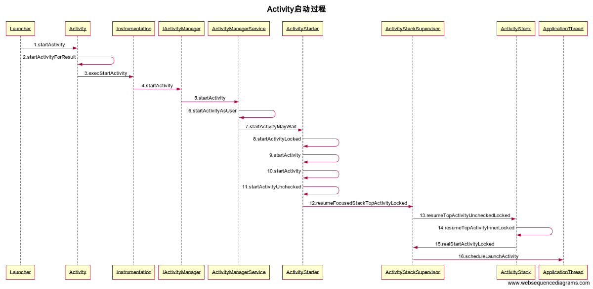

# Android7.1.0 Activity启动流程

Activity的启动分为根Activity的启动和普通Activity的启动。根Activity的启动就是APP的启动过程。

本文将结合Android系统源代码情景分析一书，尝试解析android-7.1.0_r7的根Activity的启动过程。


## 根Activity启动过程中涉及的进程

在应用程序进程没有创建的情况下，根Activity启动过程中会涉及到4个进程，分别是Zygote进程、Launcher进程、AMS所在进程（SyetemServer进程）、应用程序进程。它们之间的关系如下图所示。


首先Launcher进程向AMS请求创建根Activity，AMS会判断根Activity所需的应用程序进程是否存在并启动，如果不存在就会请求Zygote进程创建应用程序进程。应用程序进程准备就绪后会通知AMS，AMS会请求应用程序进程创建根Activity。上图中步骤2采用的是Socket通信，步骤1和步骤4采用的是Binder通信。


## Activity启动过程




当我们启动应用程序时，Launcher组件会调用它的startActivitySafely函数。

**packages/apps/Launcher3/src/com/android/launcher3/Launcher.java** 

```java
public boolean startActivitySafely(View v, Intent intent, ItemInfo item) {
		// 省略代码
            ...
        // Prepare intent
        intent.addFlags(Intent.FLAG_ACTIVITY_NEW_TASK);
        if (v != null) {
            intent.setSourceBounds(getViewBounds(v));
        }
        try {
            if (Utilities.ATLEAST_MARSHMALLOW
                    && (item instanceof ShortcutInfo)
                    && (item.itemType == Favorites.ITEM_TYPE_SHORTCUT
                     || item.itemType == Favorites.ITEM_TYPE_DEEP_SHORTCUT)
                    && !((ShortcutInfo) item).isPromise()) {
                // Shortcuts need some special checks due to legacy reasons.
                startShortcutIntentSafely(intent, optsBundle, item);
            } else if (user == null || user.equals(Process.myUserHandle())) {
                // Could be launching some bookkeeping activity
                startActivity(intent, optsBundle);
            } else {
                LauncherAppsCompat.getInstance(this).startActivityForProfile(
                        intent.getComponent(), user, intent.getSourceBounds(), optsBundle);
            }
            return true;
        } catch (ActivityNotFoundException|SecurityException e) {
            Toast.makeText(this, R.string.activity_not_found, Toast.LENGTH_SHORT).show();
            Log.e(TAG, "Unable to launch. tag=" + item + " intent=" + intent, e);
        }
        return false;
    }
```

由于应用程序还没启动，intent会添加FLAG_ACTIVITY_NEW_TASK flag，然后调用Activity的startActivity函数。

**frameworks/base/core/java/android/app/Activity.java** 

```java
@Override
public void startActivity(Intent intent, @Nullable Bundle options) {
      if (options != null) {
          startActivityForResult(intent, -1, options);
      } else {
          startActivityForResult(intent, -1);
      }
  }
```

然后我们继续跟踪startActivityForResult函数。

**frameworks/base/core/java/android/app/Activity.java** 

```java
public void startActivityForResult(@RequiresPermission Intent intent, int requestCode,
            @Nullable Bundle options) {
        if (mParent == null) {
            options = transferSpringboardActivityOptions(options);
            Instrumentation.ActivityResult ar =
                mInstrumentation.execStartActivity(
                    this, mMainThread.getApplicationThread(), mToken, this,
                    intent, requestCode, options);
           // 省略
           
        } else {
           // 省略
        }
    }
```

在上述函数中，会调用Instrumentation类的execStartActivity函数。**Instrumentation是用于监控应用程序与系统的交互。**而Activity的启动过程涉及Launcher组件和AMS，属于应用程序与系统之间的交互。因此，调用Instrumentation的execStartActivity函数。Activity 实例对象的创建，以及生命周期的激活都是通过此类进行的。

**frameworks/base/core/java/android/app/Instrumentation.java** 

```java
public ActivityResult execStartActivity(
        Context who, IBinder contextThread, IBinder token, String target,
        Intent intent, int requestCode, Bundle options) {
        IApplicationThread whoThread = (IApplicationThread) contextThread;
      // 省略
        try {
            intent.migrateExtraStreamToClipData();
            intent.prepareToLeaveProcess(who);
            int result = ActivityManager.getService()
                .startActivity(whoThread, who.getBasePackageName(), intent,
                        intent.resolveTypeIfNeeded(who.getContentResolver()),
                        token, target, requestCode, 0, null, options);
            checkStartActivityResult(result, intent);
        } catch (RemoteException e) {
            throw new RuntimeException("Failure from system", e);
        }
        return null;
    }
```

Instrumentation 的execStartActivity函数最终会调用ActivityManagerService的startActivity函数。ActivityManagerService主要用来管理Activity的生命周期

**frameworks/base/services/core/java/com/android/server/am/ActivityManagerService.java**

```java
    @Override
    public final int startActivity(IApplicationThread caller, String callingPackage,
            Intent intent, String resolvedType, IBinder resultTo, String resultWho, int requestCode,
            int startFlags, ProfilerInfo profilerInfo, Bundle bOptions) {
        return startActivityAsUser(caller, callingPackage, intent, resolvedType, resultTo,
                resultWho, requestCode, startFlags, profilerInfo, bOptions,
                UserHandle.getCallingUserId());
    }
```

然后，调用ActivityManagerService的startActivityAsUser方法。其实这个方法只是多添加了一个userId的参数。

**frameworks/base/services/core/java/com/android/server/am/ActivityManagerService.java**

```java
 @Override
    public final int startActivityAsUser(IApplicationThread caller, String callingPackage,
            Intent intent, String resolvedType, IBinder resultTo, String resultWho, int requestCode,
            int startFlags, ProfilerInfo profilerInfo, Bundle bOptions, int userId) {
            
        enforceNotIsolatedCaller("startActivity");
		
        userId = mUserController.handleIncomingUser(Binder.getCallingPid(), Binder.getCallingUid(),
                userId, false, ALLOW_FULL_ONLY, "startActivity", null);
		
        // TODO: Switch to user app stacks here.
        return mActivityStarter.startActivityMayWait(caller, -1, callingPackage, intent,
                resolvedType, null, null, resultTo, resultWho, requestCode, startFlags,
                profilerInfo, null, null, bOptions, false, userId, null, "startActivityAsUser");
    }
```


从上述代码中可以看到，startActivityAsUser方法会调用ActivityStarter的startActivityMayWait方法。ActivityStarter类负责处理Activity的Intent和Flags的逻辑, 还有管理Stack和TaskRecord.

**ActivityStarter类**的调用流程:

**frameworks/base/services/core/java/com/android/server/am/ActivityStarter.java**
```java
 final int startActivityMayWait(IApplicationThread caller, int callingUid,
            String callingPackage, Intent intent, String resolvedType,
            IVoiceInteractionSession voiceSession, IVoiceInteractor voiceInteractor,
            IBinder resultTo, String resultWho, int requestCode, int startFlags,
            ProfilerInfo profilerInfo, WaitResult outResult,
            Configuration globalConfig, Bundle bOptions, boolean ignoreTargetSecurity, int userId,
            TaskRecord inTask, String reason) {
     // 省略
         final ActivityRecord[] outRecord = new ActivityRecord[1];
            int res = startActivityLocked(caller, intent, ephemeralIntent, resolvedType,
                    aInfo, rInfo, voiceSession, voiceInteractor,
                    resultTo, resultWho, requestCode, callingPid,
                    callingUid, callingPackage, realCallingPid, realCallingUid, startFlags,
                    options, ignoreTargetSecurity, componentSpecified, outRecord, inTask,
                    reason);
     
     // 省略

    }
```
startActivityMayWait方法主要是将即将启动的Activity组件的信息，保存在ActivityInfo对象aInfo中。然后，调用startActivityLocked方法。

**frameworks/base/services/core/java/com/android/server/am/ActivityStarter.java**
```java
int startActivityLocked(IApplicationThread caller, Intent intent, Intent ephemeralIntent,
            String resolvedType, ActivityInfo aInfo, ResolveInfo rInfo,
            IVoiceInteractionSession voiceSession, IVoiceInteractor voiceInteractor,
            IBinder resultTo, String resultWho, int requestCode, int callingPid, int callingUid,
            String callingPackage, int realCallingPid, int realCallingUid, int startFlags,
            ActivityOptions options, boolean ignoreTargetSecurity, boolean componentSpecified,
            ActivityRecord[] outActivity, TaskRecord inTask, String reason) {

        if (TextUtils.isEmpty(reason)) {
            throw new IllegalArgumentException("Need to specify a reason.");
        }
        mLastStartReason = reason;
        mLastStartActivityTimeMs = System.currentTimeMillis();
        mLastStartActivityRecord[0] = null;

        mLastStartActivityResult = startActivity(caller, intent, ephemeralIntent, resolvedType,
                aInfo, rInfo, voiceSession, voiceInteractor, resultTo, resultWho, requestCode,
                callingPid, callingUid, callingPackage, realCallingPid, realCallingUid, startFlags,
                options, ignoreTargetSecurity, componentSpecified, mLastStartActivityRecord,
                inTask);

        if (outActivity != null) {
            // mLastStartActivityRecord[0] is set in the call to startActivity above.
            outActivity[0] = mLastStartActivityRecord[0];
        }

        // Aborted results are treated as successes externally, but we must track them internally.
        return mLastStartActivityResult != START_ABORTED ? mLastStartActivityResult : START_SUCCESS;
    }
```
startActivityLocked方法比较简单，主要是将mLastStartActivityRecord数组已参数的形式传给下面要调用的函数。ActivityRecord类主要用于描述堆栈中已经启动的Activity组件。


```java
 private int startActivity(IApplicationThread caller, Intent intent, Intent ephemeralIntent,
            String resolvedType, ActivityInfo aInfo, ResolveInfo rInfo,
            IVoiceInteractionSession voiceSession, IVoiceInteractor voiceInteractor,
            IBinder resultTo, String resultWho, int requestCode, int callingPid, int callingUid,
            String callingPackage, int realCallingPid, int realCallingUid, int startFlags,
            ActivityOptions options, boolean ignoreTargetSecurity, boolean componentSpecified,
            ActivityRecord[] outActivity, TaskRecord inTask) {
     // 省略
     
          return startActivity(r, sourceRecord, voiceSession, voiceInteractor, startFlags, true,
                options, inTask, outActivity);
}

```


```java
 private int startActivity(final ActivityRecord r, ActivityRecord sourceRecord,
            IVoiceInteractionSession voiceSession, IVoiceInteractor voiceInteractor,
            int startFlags, boolean doResume, ActivityOptions options, TaskRecord inTask,
            ActivityRecord[] outActivity) {
        int result = START_CANCELED;
        try {
            mService.mWindowManager.deferSurfaceLayout();
            result = startActivityUnchecked(r, sourceRecord, voiceSession, voiceInteractor,
                    startFlags, doResume, options, inTask, outActivity);
        } finally {
            // If we are not able to proceed, disassociate the activity from the task. Leaving an
            // activity in an incomplete state can lead to issues, such as performing operations
            // without a window container.
            if (!ActivityManager.isStartResultSuccessful(result)
                    && mStartActivity.getTask() != null) {
                mStartActivity.getTask().removeActivity(mStartActivity);
            }
            mService.mWindowManager.continueSurfaceLayout();
        }

        postStartActivityProcessing(r, result, mSupervisor.getLastStack().mStackId,  mSourceRecord,
                mTargetStack);

        return result;
    }

```


```java
 private int startActivityUnchecked(final ActivityRecord r, ActivityRecord sourceRecord,
            IVoiceInteractionSession voiceSession, IVoiceInteractor voiceInteractor,
            int startFlags, boolean doResume, ActivityOptions options, TaskRecord inTask,
            ActivityRecord[] outActivity) {
		// 省略

        if (mDoResume) {

            // 省略
            } else {
                // If the target stack was not previously focusable (previous top running activity
                // on that stack was not visible) then any prior calls to move the stack to the
                // will not update the focused stack.  If starting the new activity now allows the
                // task stack to be focusable, then ensure that we now update the focused stack
                // accordingly.
                if (mTargetStack.isFocusable() && !mSupervisor.isFocusedStack(mTargetStack)) {
                    mTargetStack.moveToFront("startActivityUnchecked");
                }
                mSupervisor.resumeFocusedStackTopActivityLocked(mTargetStack, mStartActivity,
                        mOptions);
            }
        }
// 省略

	mSupervisor.updateUserStackLocked(mStartActivity.userId, mTargetStack);

        mSupervisor.handleNonResizableTaskIfNeeded(mStartActivity.getTask(), preferredLaunchStackId,
                preferredLaunchDisplayId, mTargetStack.mStackId);

        return START_SUCCESS;
}

```


ActivityStackSupervisor负责管理Task和Stack, 而ActivityStack负责管理在Stack和Task中的Activity. 


```java
boolean resumeFocusedStackTopActivityLocked(
            ActivityStack targetStack, ActivityRecord target, ActivityOptions targetOptions) {

        if (!readyToResume()) {
            return false;
        }

        if (targetStack != null && isFocusedStack(targetStack)) {
            return targetStack.resumeTopActivityUncheckedLocked(target, targetOptions);
        }

        final ActivityRecord r = mFocusedStack.topRunningActivityLocked();
        if (r == null || r.state != RESUMED) {
            mFocusedStack.resumeTopActivityUncheckedLocked(null, null);
        } else if (r.state == RESUMED) {
            // Kick off any lingering app transitions form the MoveTaskToFront operation.
            mFocusedStack.executeAppTransition(targetOptions);
        }

        return false;
    }
```


ActivityStack用以管理任务栈中activities。

```java
boolean resumeTopActivityUncheckedLocked(ActivityRecord prev, ActivityOptions options) {
        if (mStackSupervisor.inResumeTopActivity) {
            // Don't even start recursing.
            return false;
        }

        boolean result = false;
        try {
            // Protect against recursion.
            mStackSupervisor.inResumeTopActivity = true;
            result = resumeTopActivityInnerLocked(prev, options);
        } finally {
            mStackSupervisor.inResumeTopActivity = false;
        }

        // When resuming the top activity, it may be necessary to pause the top activity (for
        // example, returning to the lock screen. We suppress the normal pause logic in
        // {@link #resumeTopActivityUncheckedLocked}, since the top activity is resumed at the end.
        // We call the {@link ActivityStackSupervisor#checkReadyForSleepLocked} again here to ensure
        // any necessary pause logic occurs. In the case where the Activity will be shown regardless
        // of the lock screen, the call to {@link ActivityStackSupervisor#checkReadyForSleepLocked}
        // is skipped.
        final ActivityRecord next = topRunningActivityLocked(true /* focusableOnly */);
        if (next == null || !next.canTurnScreenOn()) {
            checkReadyForSleep();
        }

        return result;
    }

```


```java
 private boolean resumeTopActivityInnerLocked(ActivityRecord prev, ActivityOptions options) {
     // 省略
      mStackSupervisor.startSpecificActivityLocked(next, true, false);
     // 省略
 }
     
```


```java
void startSpecificActivityLocked(ActivityRecord r,
            boolean andResume, boolean checkConfig) {
        // Is this activity's application already running?
        ProcessRecord app = mService.getProcessRecordLocked(r.processName,
                r.info.applicationInfo.uid, true);

        r.getStack().setLaunchTime(r);

        if (app != null && app.thread != null) {
            try {
                if ((r.info.flags&ActivityInfo.FLAG_MULTIPROCESS) == 0
                        || !"android".equals(r.info.packageName)) {
                    // Don't add this if it is a platform component that is marked
                    // to run in multiple processes, because this is actually
                    // part of the framework so doesn't make sense to track as a
                    // separate apk in the process.
                    app.addPackage(r.info.packageName, r.info.applicationInfo.versionCode,
                            mService.mProcessStats);
                }
                realStartActivityLocked(r, app, andResume, checkConfig);
                return;
            } catch (RemoteException e) {
                Slog.w(TAG, "Exception when starting activity "
                        + r.intent.getComponent().flattenToShortString(), e);
            }

            // If a dead object exception was thrown -- fall through to
            // restart the application.
        }

        mService.startProcessLocked(r.processName, r.info.applicationInfo, true, 0,
                "activity", r.intent.getComponent(), false, false, true);
    }

```


```java
  final boolean realStartActivityLocked(ActivityRecord r, ProcessRecord app,
            boolean andResume, boolean checkConfig) throws RemoteException {
	// 省略
    app.thread.scheduleLaunchActivity(new Intent(r.intent), r.appToken,
                            System.identityHashCode(r), r.info,
                            // TODO: Have this take the merged configuration instead of separate global
                            // and override configs.
                            mergedConfiguration.getGlobalConfiguration(),
                            mergedConfiguration.getOverrideConfiguration(), r.compat,
                            r.launchedFromPackage, task.voiceInteractor, app.repProcState, r.icicle,
                            r.persistentState, results, newIntents, !andResume,
                            mService.isNextTransitionForward(), profilerInfo);
      // 省略
  }
```

- Launcher

Launcher组件运行在一个独立的进程。

- Activity
- 
- ActivityManagerService
- ActivityStarter

Controller for interpreting how and then launching activities.This class collects all the logic for determining how an intent and flags should be turned into an activity and associated task and stack.

- ActivityInfo
- ActivityStack用以管理任务栈中activities


## ActivityThread


```java
 @Override
        public final void scheduleLaunchActivity(Intent intent, IBinder token, int ident,
                ActivityInfo info, Configuration curConfig, Configuration overrideConfig,
                CompatibilityInfo compatInfo, String referrer, IVoiceInteractor voiceInteractor,
                int procState, Bundle state, PersistableBundle persistentState,
                List<ResultInfo> pendingResults, List<ReferrerIntent> pendingNewIntents,
                boolean notResumed, boolean isForward, ProfilerInfo profilerInfo) {

            updateProcessState(procState, false);

            ActivityClientRecord r = new ActivityClientRecord();

            r.token = token;
            r.ident = ident;
            r.intent = intent;
            r.referrer = referrer;
            r.voiceInteractor = voiceInteractor;
           // 省略

            sendMessage(H.LAUNCH_ACTIVITY, r);
        }
```


```java
 private void sendMessage(int what, Object obj) {
        sendMessage(what, obj, 0, 0, false);
 }

 private void sendMessage(int what, Object obj, int arg1, int arg2, boolean async) {
        if (DEBUG_MESSAGES) Slog.v(
            TAG, "SCHEDULE " + what + " " + mH.codeToString(what)
            + ": " + arg1 + " / " + obj);
        Message msg = Message.obtain();
        msg.what = what;
        msg.obj = obj;
        msg.arg1 = arg1;
        msg.arg2 = arg2;
        if (async) {
            msg.setAsynchronous(true);
        }
        mH.sendMessage(msg);
    }
```


mH是H的变量，H是ActivityThread的内部类，继承于Handler。H用于处理主线程中的消息。在启动Activity时，ActivityClientRecord对象传给Handler。

```java
 private class H extends Handler {
     public void handleMessage(Message msg) {
            if (DEBUG_MESSAGES) Slog.v(TAG, ">>> handling: " + codeToString(msg.what));
            switch (msg.what) {
                case LAUNCH_ACTIVITY: {
                    Trace.traceBegin(Trace.TRACE_TAG_ACTIVITY_MANAGER, "activityStart");
                    final ActivityClientRecord r = (ActivityClientRecord) msg.obj;

                    r.loadedApk = getLoadedApkNoCheck(
                            r.activityInfo.applicationInfo, r.compatInfo);
                    handleLaunchActivity(r, null, "LAUNCH_ACTIVITY");
                    Trace.traceEnd(Trace.TRACE_TAG_ACTIVITY_MANAGER);
                } break;
                // 省略
            }
        // 省略
 }
```

在handleMessage 中处理LAUNCH_ACTIVITY事件。

首先通过getPackageInfoNoCheck方法获得LoadedApk类型的对象并赋值给ActivityClientRecord 的成员变量packageInfo 。应用程序进程要启动Activity时需要将该Activity所属的APK加载进来，而LoadedApk就是用来描述已加载的APK文件。

然后调用handleLaunchActivity方法。

```java
 private void handleLaunchActivity(ActivityClientRecord r, Intent customIntent, String reason) {
        // If we are getting ready to gc after going to the background, well
        // we are back active so skip it.
        unscheduleGcIdler();
        mSomeActivitiesChanged = true;

        if (r.profilerInfo != null) {
            mProfiler.setProfiler(r.profilerInfo);
            mProfiler.startProfiling();
        }

        // Make sure we are running with the most recent config.
        handleConfigurationChanged(null, null);

        if (localLOGV) Slog.v(
            TAG, "Handling launch of " + r);

        // Initialize before creating the activity
        if (!ThreadedRenderer.sRendererDisabled) {
            GraphicsEnvironment.earlyInitEGL();
        }
        WindowManagerGlobal.initialize();
		// 启动Activity
        Activity a = performLaunchActivity(r, customIntent);

        if (a != null) {
            r.createdConfig = new Configuration(mConfiguration);
            reportSizeConfigurations(r);
            Bundle oldState = r.state;
            // Activity 进入onResume状态。不论是onCreate 还是onResume，
            // 都是通过Instrumentation管理的。
            handleResumeActivity(r.token, false, r.isForward,
                    !r.activity.mFinished && !r.startsNotResumed, r.lastProcessedSeq, reason);

            if (!r.activity.mFinished && r.startsNotResumed) {
                // The activity manager actually wants this one to start out paused, because it
                // needs to be visible but isn't in the foreground. We accomplish this by going
                // through the normal startup (because activities expect to go through onResume()
                // the first time they run, before their window is displayed), and then pausing it.
                // However, in this case we do -not- need to do the full pause cycle (of freezing
                // and such) because the activity manager assumes it can just retain the current
                // state it has.
                performPauseActivityIfNeeded(r, reason);

                // We need to keep around the original state, in case we need to be created again.
                // But we only do this for pre-Honeycomb apps, which always save their state when
                // pausing, so we can not have them save their state when restarting from a paused
                // state. For HC and later, we want to (and can) let the state be saved as the
                // normal part of stopping the activity.
                if (r.isPreHoneycomb()) {
                    r.state = oldState;
                }
            }
        } else {
            // If there was an error, for any reason, tell the activity manager to stop us.
            try {
                ActivityManager.getService()
                    .finishActivity(r.token, Activity.RESULT_CANCELED, null,
                            Activity.DONT_FINISH_TASK_WITH_ACTIVITY);
            } catch (RemoteException ex) {
                throw ex.rethrowFromSystemServer();
            }
        }
    }
```

调用performLaunchActivity方法用来启动Activity。


```java
 private Activity performLaunchActivity(ActivityClientRecord r, Intent customIntent) {
        // System.out.println("##### [" + System.currentTimeMillis() + "] ActivityThread.performLaunchActivity(" + r + ")");
		//获取ActivityInfo
        ActivityInfo aInfo = r.activityInfo;
     	// 获取LoadedApk
        if (r.loadedApk == null) {
            r.loadedApk = getLoadedApk(aInfo.applicationInfo, r.compatInfo,
                    Context.CONTEXT_INCLUDE_CODE);
        }
		
     	// 获取ComponentName, 通过ComponentName获取Activity名称
        ComponentName component = r.intent.getComponent();
        if (component == null) {
            component = r.intent.resolveActivity(
                mInitialApplication.getPackageManager());
            r.intent.setComponent(component);
        }

        if (r.activityInfo.targetActivity != null) {
            component = new ComponentName(r.activityInfo.packageName,
                    r.activityInfo.targetActivity);
        }
		// 创建Context
        ContextImpl appContext = createBaseContextForActivity(r);
        Activity activity = null;
        try {
            java.lang.ClassLoader cl = appContext.getClassLoader();
            //通过Instrumentation 反射加载待启动的Activity
            activity = mInstrumentation.newActivity(
                    cl, component.getClassName(), r.intent);
            StrictMode.incrementExpectedActivityCount(activity.getClass());
            r.intent.setExtrasClassLoader(cl);
            r.intent.prepareToEnterProcess();
            if (r.state != null) {
                r.state.setClassLoader(cl);
            }
        } catch (Exception e) {
            if (!mInstrumentation.onException(activity, e)) {
                throw new RuntimeException(
                    "Unable to instantiate activity " + component
                    + ": " + e.toString(), e);
            }
        }

        try {
            // 创建Application，调用Application的onCreate方法
            Application app = r.loadedApk.makeApplication(false, mInstrumentation);

            if (localLOGV) Slog.v(TAG, "Performing launch of " + r);
            if (localLOGV) Slog.v(
                    TAG, r + ": app=" + app
                    + ", appName=" + app.getPackageName()
                    + ", pkg=" + r.loadedApk.getPackageName()
                    + ", comp=" + r.intent.getComponent().toShortString()
                    + ", dir=" + r.loadedApk.getAppDir());

            if (activity != null) {
                // 获取Activity在xml中设置的标题
                CharSequence title = r.activityInfo.loadLabel(appContext.getPackageManager());
                Configuration config = new Configuration(mCompatConfiguration);
                if (r.overrideConfig != null) {
                    config.updateFrom(r.overrideConfig);
                }
                if (DEBUG_CONFIGURATION) Slog.v(TAG, "Launching activity "
                        + r.activityInfo.name + " with config " + config);
                Window window = null;
                if (r.mPendingRemoveWindow != null && r.mPreserveWindow) {
                    window = r.mPendingRemoveWindow;
                    r.mPendingRemoveWindow = null;
                    r.mPendingRemoveWindowManager = null;
                }
                appContext.setOuterContext(activity);
                // 初始化Activity的一些成员变量，关联PhoneWindow
                activity.attach(appContext, this, getInstrumentation(), r.token,
                        r.ident, app, r.intent, r.activityInfo, title, r.parent,
                        r.embeddedID, r.lastNonConfigurationInstances, config,
                        r.referrer, r.voiceInteractor, window, r.configCallback);

                if (customIntent != null) {
                    activity.mIntent = customIntent;
                }
                r.lastNonConfigurationInstances = null;
                checkAndBlockForNetworkAccess();
                activity.mStartedActivity = false;
                int theme = r.activityInfo.getThemeResource();
                if (theme != 0) {
                    // 设置Activity的主题
                    activity.setTheme(theme);
                }
				
                // 调用Activity的onCreate方法
                activity.mCalled = false;
                if (r.isPersistable()) {
                    mInstrumentation.callActivityOnCreate(activity, r.state, r.persistentState);
                } else {
                    mInstrumentation.callActivityOnCreate(activity, r.state);
                }
                if (!activity.mCalled) {
                    throw new SuperNotCalledException(
                        "Activity " + r.intent.getComponent().toShortString() +
                        " did not call through to super.onCreate()");
                }
                r.activity = activity;
                r.stopped = true;
                if (!r.activity.mFinished) {
                    activity.performStart();
                    r.stopped = false;
                }
                if (!r.activity.mFinished) {
                    if (r.isPersistable()) {
                        if (r.state != null || r.persistentState != null) {
                            mInstrumentation.callActivityOnRestoreInstanceState(activity, r.state,
                                    r.persistentState);
                        }
                    } else if (r.state != null) {
                        mInstrumentation.callActivityOnRestoreInstanceState(activity, r.state);
                    }
                }
                if (!r.activity.mFinished) {
                    activity.mCalled = false;
                    if (r.isPersistable()) {
                        mInstrumentation.callActivityOnPostCreate(activity, r.state,
                                r.persistentState);
                    } else {
                        mInstrumentation.callActivityOnPostCreate(activity, r.state);
                    }
                    if (!activity.mCalled) {
                        throw new SuperNotCalledException(
                            "Activity " + r.intent.getComponent().toShortString() +
                            " did not call through to super.onPostCreate()");
                    }
                }
            }
            r.paused = true;

            mActivities.put(r.token, r);

        } catch (SuperNotCalledException e) {
            throw e;

        } catch (Exception e) {
            if (!mInstrumentation.onException(activity, e)) {
                throw new RuntimeException(
                    "Unable to start activity " + component
                    + ": " + e.toString(), e);
            }
        }

        return activity;
    }
```

- 获取ActivityInfo，ActivityInfo用于存储代码和AndroidManifes设置的Activity和receiver节点信息，比如Activity的theme和launchMode。
- 获取APK文件的描述类LoadedApk
- 获取要启动的Activity的ComponentName类，ComponentName类中保存了该Activity的包名和类名.
- 创建要启动Activity的上下文环境。
- 根据ComponentName中存储的Activity类名，用类加载器来创建该Activity的实例。
- 创建Application，makeApplication方法内部会调用Application的onCreate方法。
- Activity的attach方法初始化Activity，attach方法中会创建Window对象（PhoneWindow）并与Activity自身进行关联。
- 调用Instrumentation的callActivityOnCreate方法来启动Activity

```java
public void callActivityOnCreate(Activity activity, Bundle icicle,
          PersistableBundle persistentState) {
      prePerformCreate(activity);
      activity.performCreate(icicle, persistentState);//1
      postPerformCreate(activity);
  }
```

activity.performCreate 会调用Activity的onCreate方法，到此，Activity就启动了。


