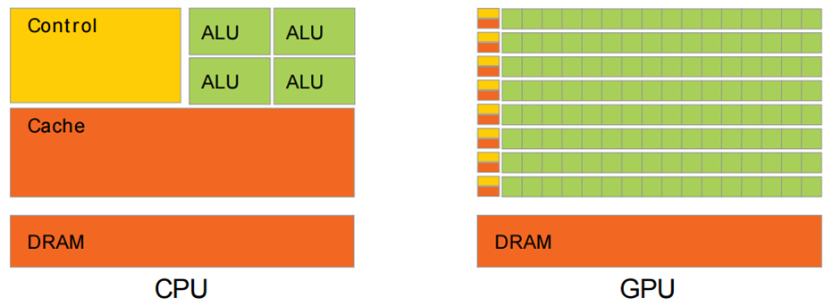

# 硬件加速

## CPU 和 GPU

CPU（Central Processing Unit，中央处理器）是计算机设备核心器件，用于执行程序代码，软件开发者对此都很熟悉；GPU（Graphics Processing Unit，图形处理器）主要用于处理图形运算，通常所说“显卡”的核心部件就是GPU。

下面是CPU和GPU的结构对比图。其中：

- 黄色的Control为控制器，用于协调控制整个CPU的运行，包括取出指令、控制其他模块的运行等；
- 绿色的ALU（Arithmetic Logic Unit）是算术逻辑单元，用于进行数学、逻辑运算；
- 橙色的Cache和DRAM分别为缓存和RAM，用于存储信息。



- 从结构图可以看出，CPU的控制器较为复杂，而ALU数量较少。因此CPU擅长各种复杂的逻辑运算，但不擅长数学尤其是浮点运算。
  - 以8086为例，一百多条汇编指令大部分都是逻辑指令，数学计算相关的主要是16位加减乘除和移位运算。一次整型和逻辑运算一般需要1~3个机器周期，而浮点运算要转换成整数计算，一次运算可能消耗上百个机器周期。
  - 更简单的CPU甚至只有加法指令，减法用补码加法实现，乘法用累加实现，除法用减法循环实现。
  - 现代CPU一般都带有硬件浮点运算器（FPU），但主要适用于数据量不大的情况。
- CPU是串行结构。以计算100个数字为例，对于CPU的一个核，每次只能计算两个数的和，结果逐步累加。
- 和CPU不同的是，GPU就是为实现大量数学运算设计的。从结构图中可以看到，GPU的控制器比较简单，但包含了大量ALU。GPU中的ALU使用了并行设计，且具有较多浮点运算单元。
- 硬件加速的主要原理，就是通过底层软件代码，将CPU不擅长的图形计算转换成GPU专用指令，由GPU完成。

> 扩展：很多计算机中的GPU有自己独立的显存；没有独立显存则使用共享内存的形式，从内存中划分一块区域作为显存。显存可以保存GPU指令等信息。

## 基本使用

可以在以下层级控制是否启用硬件加速。

- Application

```xml
<application android:hardwareAccelerated="true" ...>
```


- Activity

```xml
<application android:hardwareAccelerated="true">
    <activity ... />
    <activity android:hardwareAccelerated="false" />
</application>
```


- Window

```java
getWindow().setFlags(
    WindowManager.LayoutParams.FLAG_HARDWARE_ACCELERATED,
    WindowManager.LayoutParams.FLAG_HARDWARE_ACCELERATED);
```


- View

```java
myView.setLayerType(View.LAYER_TYPE_SOFTWARE, null);
```


## Android 中的硬件加速

在Android中，大多数应用的界面都是利用常规的View来构建的（除了游戏、视频、图像等应用可能直接使用OpenGL ES）。下面根据Android 6.0原生系统的Java层代码，对View的软件和硬件加速渲染做一些分析和对比。

### DisplayList

DisplayList是一个基本绘制元素，包含元素原始属性（位置、尺寸、角度、透明度等），对应Canvas的drawXxx()方法（如下图）。

信息传递流程：Canvas(Java API) —> OpenGL(C/C++ Lib) —> 驱动程序 —> GPU。

在Android 4.1及以上版本，DisplayList支持属性，如果View的一些属性发生变化（比如Scale、Alpha、Translate），只需把属性更新给GPU，不需要生成新的DisplayList。

### RenderNode

一个RenderNode包含若干个DisplayList，通常一个RenderNode对应一个View，包含View自身及其子View的所有DisplayList。


## Android绘制流程（Android 6.0）

下面是安卓View完整的绘制流程图，主要通过阅读源码和调试得出，虚线箭头表示递归调用。

- 从`ViewRootImpl.performTraversals`到`PhoneWindow.DecroView.drawChild`是每次遍历View树的固定流程，首先根据标志位判断是否需要重新布局并执行布局；然后进行Canvas的创建等操作开始绘制。

  - 如果硬件加速不支持或者被关闭，则使用软件绘制，生成的Canvas即`Canvas.class`的对象；
  - 如果支持硬件加速，则生成的是`DisplayListCanvas.class`的对象；
  - 两者的`isHardwareAccelerated()`方法返回的值分别为false、true，View根据这个值判断是否使用硬件加速。

- View中的`draw(canvas,parent,drawingTime)` - `draw(canvas)` - `onDraw` - `dispachDraw` - `drawChild`这条递归路径（下文简称**Draw路径**），调用了`Canvas.drawXxx()`方法，在软件渲染时用于实际绘制；在硬件加速时，用于构建DisplayList。

- View中的`updateDisplayListIfDirty` - `dispatchGetDisplayList` - `recreateChildDisplayList`这条递归路径（下文简称**DisplayList路径**），仅在硬件加速时会经过，用于在遍历View树绘制的过程中更新DisplayList属性，并快速跳过不需要重建DisplayList的View。

  > Android 6.0中，和DisplayList相关的API目前仍被标记为“@hide”不可访问，表示还不成熟，后续版本可能开放。

- 硬件加速情况下，draw流程执行结束后DisplayList构建完成，然后通过`ThreadedRenderer.nSyncAndDrawFrame()`利用GPU绘制DisplayList到屏幕上。


## 纯软件绘制 VS 硬件加速（Android 6.0）


| 渲染场景                                                     | 纯软件绘制               | 硬件加速                                                    | 加速效果分析                                                 |
| ------------------------------------------------------------ | ------------------------ | ----------------------------------------------------------- | ------------------------------------------------------------ |
| 页面初始化                                                   | 绘制所有View             | 创建所有DisplayList                                         | GPU分担了复杂计算任务                                        |
| 在一个复杂页面调用背景透明TextView的setText()，且调用后其尺寸位置不变 | 重绘脏区所有View         | TextView及每一级父View重建DisplayList                       | 重叠的兄弟节点不需CPU重绘，GPU会自行处理                     |
| extView逐帧播放Alpha / Translation / Scale动画               | 每帧都要重绘脏区所有View | 除第一帧同场景2，之后每帧只更新TextView对应RenderNode的属性 | 刷新一帧性能极大提高，动画流畅度提高                         |
| 修改TextView透明度                                           | 重绘脏区所有View         | 直接调用RenderNode.setAlpha()更新                           | 加速前需全页面遍历，并重绘很多View；加速后只触发DecorView.updateDisplayListIfDirty，不再往下遍历，CPU执行时间可忽略不计 |


- 场景1中，无论是否加速，遍历View树并都会走Draw路径。硬件加速后Draw路径不做实际绘制工作，只是构建DisplayList，复杂的绘制计算任务被GPU分担，已经有了较大的加速效果。
- 场景2中，TextView设置前后尺寸位置不变，不会触发重新Layout。
  - 软件绘制时，TextView所在区域即为脏区。由于TextView有透明区域，遍历View树的过程中，和脏区重叠的多数View都要重绘，包括与之重叠的兄弟节点和他们的父节点（详见后面的介绍），不需要绘制的View在`draw(canvas,parent,drawingTime)`方法中判断直接返回。
  - 硬件加速后，也需要遍历View树，但只有TextView及其每一层父节点需要重建DisplayList，走的是Draw路径，其他View直接走了DisplayList路径，剩下的工作都交给GPU处理。页面越复杂，两者性能差距越明显。
- 场景3中，软件绘制每一帧都要做大量绘制工作，很容易导致动画卡顿。硬件加速后，动画过程直接走DisplayList路径更新DisplayList的属性，动画流畅度能得到极大提高。
- 场景4中，两者的性能差距更明显。简单修改透明度，软件绘制仍然要做很多工作；硬件加速后一般直接更新RenderNode的属性，不需要触发invalidate，也不会遍历View树（除了少数View可能要对Alpha做特殊响应并在`onSetAlpha()`返回true，代码如下）。

```java
public class View {
    // ...
    public void setAlpha(@FloatRange(from=0.0, to=1.0) float alpha) {
        ensureTransformationInfo();
        if (mTransformationInfo.mAlpha != alpha) {
            mTransformationInfo.mAlpha = alpha;
            if (onSetAlpha((int) (alpha * 255))) {
                // ...
                invalidate(true);
            } else {
                // ...
                mRenderNode.setAlpha(getFinalAlpha());
                // ...
            }
        }
    }

    protected boolean onSetAlpha(int alpha) {
        return false;
    }
    // ...
}
```

## 软件绘制刷新逻辑简介


实际阅读源码并实验，得出通常情况下的软件绘制刷新逻辑：

- 默认情况下，View的clipChildren属性为true，即每个View绘制区域不能超出其父View的范围。如果设置一个页面根布局的clipChildren属性为false，则子View可以超出父View的绘制区域。
- 当一个View触发invalidate，且没有播放动画、没有触发layout的情况下：
  - 对于全不透明的View，其自身会设置标志位`PFLAG_DIRTY`，其父View会设置标志位`PFLAG_DIRTY_OPAQUE`。在`draw(canvas)`方法中，只有这个View自身重绘。
  - 对于可能有透明区域的View，其自身和父View都会设置标志位`PFLAG_DIRTY`。
  - clipChildren为true时，脏区会被转换成ViewRoot中的Rect，刷新时层层向下判断，当View与脏区有重叠则重绘。如果一个View超出父View范围且与脏区重叠，但其父View不与脏区重叠，这个子View不会重绘。
  - clipChildren为false时，`ViewGroup.invalidateChildInParent()`中会把脏区扩大到自身整个区域，于是与这个区域重叠的所有View都会重绘。

## 总结

至此，硬件加速相关的内容就介绍完了，这里做个简单总结：

- CPU更擅长复杂逻辑控制，而GPU得益于大量ALU和并行结构设计，更擅长数学运算。
- 页面由各种基础元素（DisplayList）构成，渲染时需要进行大量浮点运算。
- 硬件加速条件下，CPU用于控制复杂绘制逻辑、构建或更新DisplayList；GPU用于完成图形计算、渲染DisplayList。
- 硬件加速条件下，刷新界面尤其是播放动画时，CPU只重建或更新必要的DisplayList，进一步提高渲染效率。
- 实现同样效果，应尽量使用更简单的DisplayList，从而达到更好的性能（Shape代替Bitmap等）