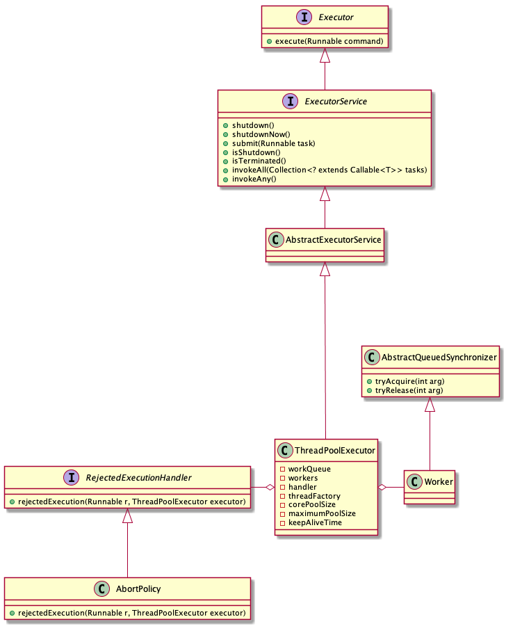

# Java 线程池

## 线程池的基本使用


### 创建线程池

```java
new ThreadPoolExecutor(int corePoolSize,
                              int maximumPoolSize,
                              long keepAliveTime,
                              TimeUnit unit,
                              BlockingQueue<Runnable> workQueue,
                              ThreadFactory threadFactory,
                              RejectedExecutionHandler handler) {}
```

- corePoolSize：线程池的基本大小。当提交一个任务到线程池时，线程池会创建一个线程来执行任务，即使其他空闲的基本线程能够执行新任务也会创建线程，等到需要执行的任务数大于线程池基本大小时就不再创建。如果调用了线程池的prestartAllCoreThreads方法，线程池会提前创建并启动所有基本线程。

- maximumPoolSize：线程池的最大大小。线程池允许创建的最大线程数。如果队列满了，并且已创建的线程数小于最大线程数，则线程池会再创建新的线程执行任务。值得注意的是如果使用了无界的任务队列这个参数就没什么效果。

- keepAliveTime：线程池的工作线程空闲后，保持存活的时间。所以如果任务很多，并且每个任务执行的时间比较短，可以调大这个时间，提高线程的利用率。

- unit：keepAliveTime的时间单位

- workQueue：用于保存等待执行的任务的阻塞队列。 可以选择以下几个阻塞队列。

- handler: 当线程池的任务缓存队列已满并且线程池中的线程数目达到maximumPoolSize，如果还有任务到来就会采取任务拒绝策略，通常有以下四种策略：

  1. `ThreadPoolExecutor.AbortPolicy`:丢弃任务并抛出RejectedExecutionException异常。
  2. `ThreadPoolExecutor.DiscardPolicy`：也是丢弃任务，但是不抛出异常。
  3. `ThreadPoolExecutor.DiscardOldestPolicy`：丢弃队列最前面的任务，然后重新尝试执行任务（重复此过程）
  4. `ThreadPoolExecutor.CallerRunsPolicy`：由调用线程处理该任务


为了使用方便，Executors工具类提供了几个创建线程池的方法。

- `newCachedThreadPool`创建一个可缓存线程池，如果线程池长度超过处理需要，可灵活回收空闲线程，若无可回收，则新建线程。
- `newFixedThreadPool` 创建一个定长线程池，可控制线程最大并发数，超出的线程会在队列中等待。
- `newScheduledThreadPool `创建一个定长线程池，支持定时及周期性任务执行。
- `newSingleThreadExecutor` 创建一个单线程化的线程池，它只会用唯一的工作线程来执行任务，保证所有任务按照指定顺序(FIFO, LIFO, 优先级)执行。


```java
ExecutorService cachedThreadPool = Executors.newCachedThreadPool();
```


> 


## 线程池实现原理


### 类图结构




