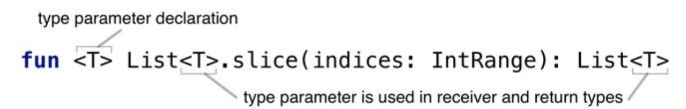
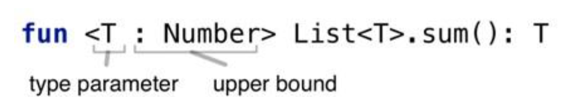

# Kotlin学习笔记：泛型


Kotlin的泛型创建和Java几乎一样。在运行时，也会进行类型擦除。

## 创建泛型函数


## 创建泛型类


## 类型参数约束

T : Number等价于T extends Number 

## 泛型的定义

## 


## 类型参数的约束

T : Number等价于T extends Number 



## reified类型参数

Kotlin在运行时，也会进行类型擦除。但是如果想要在运行时获取正确的类型参数类型，可以使用refied关键字。reified只能用于inline函数。

Collection的filterIsInstance方法就是使用refied，可以从集合中选择指定类型的实例。

```kotlin
inline fun <reified T> Iterable<*>.filterIsInstance(): List<T>{ 
    val destination = mutableListOf<T>()
	for (element in this) {
		if (element is T){ 
            destination.add(element)
		}
	}
 	return destination
}
```


实现原理

编译器把内联函数的字节码插入到每一次被调用的地方

每次调用reified函数时，编译器知道类型参数的确切类型、

编译器可以生产引用作为类型实参的具体类字节码

生成的字节码引用了具体类，而不是类型参数


refied函数不能被Java调用

应用场景


```kotlin
inline fun <reified T: Activity> Context.startActivity(){
    val intent = Intent(this, T::class.java)
    startActivity(intent)
}
```


