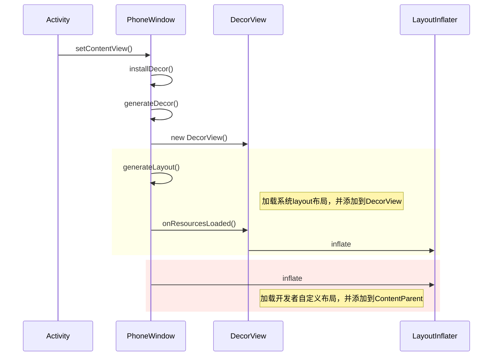

```mermaid
sequenceDiagram
	Activity ->> PhoneWindow:setContentView()
	PhoneWindow ->> PhoneWindow:installDecor()
	PhoneWindow ->> PhoneWindow:generateDecor()
	PhoneWindow ->> DecorView:new DecorView()
	rect rgb(255, 255, 233)
	PhoneWindow ->> PhoneWindow:generateLayout()
	Note right of DecorView: 加载系统layout布局，并添加到DecorView
	PhoneWindow ->> DecorView:onResourcesLoaded()
	DecorView ->> LayoutInflater:inflate
	end
	
	rect rgb(255, 235, 233)
	PhoneWindow ->> LayoutInflater:inflate
	Note right of DecorView: 加载开发者自定义布局，并添加到ContentParent
	end
```

