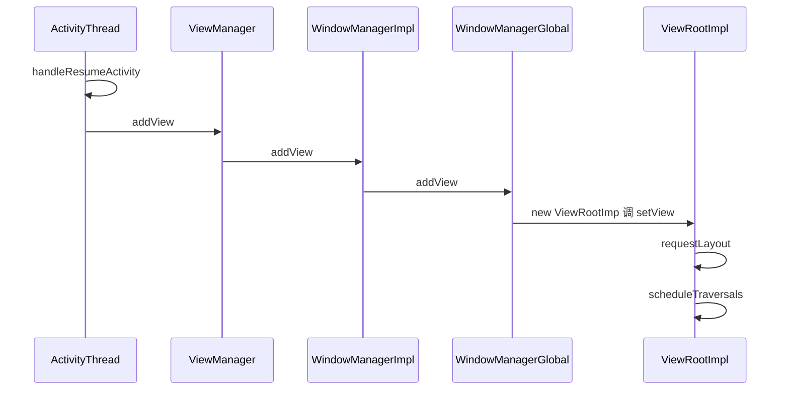
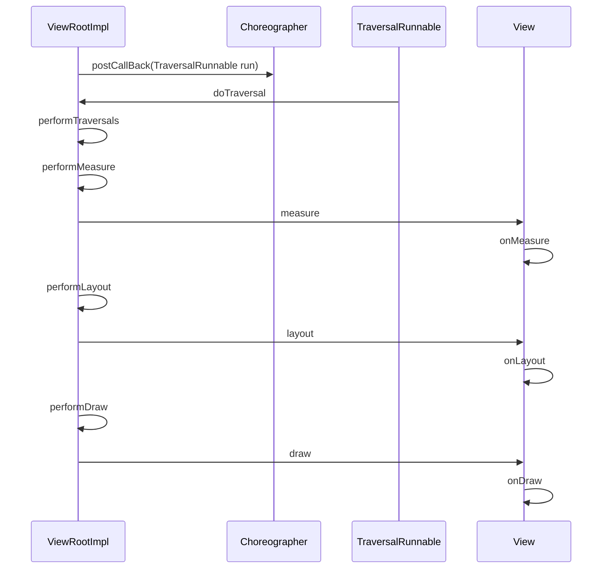

# View绘制流程

在Activity#onResume后，将DecorView添加到Window，遍历DecorView下的View树，依次measure，layout，draw View。

将DecorView添加到Window，具体实现在WindowManagerGlobal#addView中。addView 的逻辑：创建ViewRootImpl实例，然后调用ViewRootImpl#setView方法。

