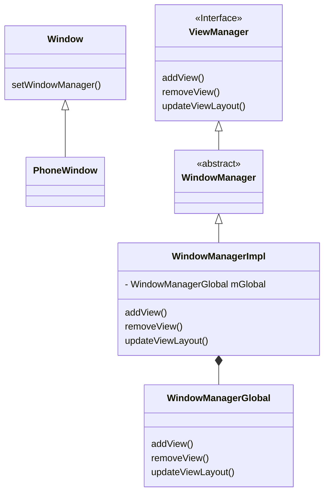

# Window WindowManager WindowManagerService

在创建Activity时，创建对应Activity的Window（在Activity#attach方法中，实例化PhoneWindow对象）。在Activity#setContentView中，将layout添加到DecorView中。

View不能独立存在，必须依附于Window。Activity有自己的Window，创建dialog时，也会创建相应的Window

Window实例化

Activity#attach方法中，创建PhoneWindow对象和WindowManager，调用Window#setWindowManager，与WindowManager关联

创建DecorView

PhoneWindow#setContentView方法中创建DecorView，并将layout布局set到ContentView中。解析View树。

创建Window

创建ViewRootImpl

创建DecorView

