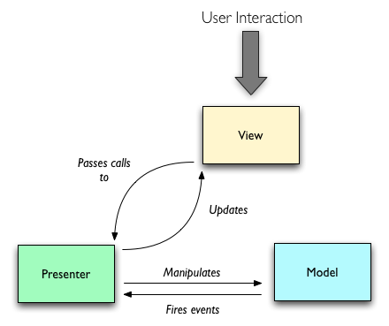
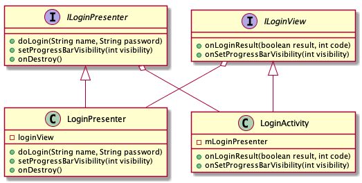

# MVP模式
MVP模式的核心思想：
MVP把Activity中的UI逻辑抽象成View接口，把业务逻辑抽象成Presenter接口，Model类还是原来的Model。




## 优点
- 分离了视图逻辑和业务逻辑，降低了耦合

- Activity只处理生命周期的任务，代码变得更加简洁

- 视图逻辑和业务逻辑分别抽象到了View和Presenter的接口中去，提高代码的可阅读性

- Presenter被抽象成接口，可以有多种具体的实现，所以方便进行单元测试

- 把业务逻辑抽到Presenter中去，避免后台线程引用着Activity导致Activity的资源无法被系统回收从而引起内存泄露和OOM


## 实例




### Presenter

Presenter 中主要处理业务逻辑。在登录模块中，业务逻辑主要有登录，显示登录进度条等等。

```java
package com.example.nxiangbo.notereader.login.presenter;

public interface ILoginPresenter {
    void clear();
    void doLogin(String name, String password);
    void setProgressBarVisibility(int visibility);
    void onDestroy();
}
```


### View

View 中主要处理UI相关的逻辑。在登录模块中，UI相关逻辑包括登录成功和失败后的UI展示等。

```java
package com.example.nxiangbo.notereader.login.view;

public interface ILoginView {
    void onClearText();
    void onLoginResult(boolean result, int code);
    void onSetProgressBarVisibility(int visibility);
}
```


### 实现Presenter接口

```java
public class LoginPresenter implements ILoginPresenter {
    private ILoginView loginView;
    private Handler handler;

    public LoginPresenter(ILoginView loginView) {
        this.loginView = loginView;
        handler = new Handler(Looper.getMainLooper());
    }

    @Override
    public void clear() {
        loginView.onClearText();
    }

    @Override
    public void doLogin(String name, String password) {
        boolean result;
        int code = 200;

        if (name.equals("nxiangbo") && password.equals("123456")) {
            result = true;
            code = 200;
        } else {
            result = false;
            code = 400;
        }

        int finalCode = code;
        handler.postDelayed(new Runnable() {
            @Override
            public void run() {
                loginView.onLoginResult(result, finalCode);
            }
        }, 3000);

    }

    @Override
    public void setProgressBarVisibility(int visibility) {
        loginView.onSetProgressBarVisibility(visibility);
    }

    @Override
    public void onDestroy() {
        loginView = null;
    }
}
```


### Activity 

```java
public class LoginActivity extends AppCompatActivity implements ILoginView {
    @BindView(R.id.login_account)
    EditText mUserName;

    @BindView(R.id.login_password)
    EditText mPassword;

    @BindView(R.id.btn_login)
    Button mLogin;
    @BindView(R.id.progress)
    ProgressBar  mProgressBar;

    private ILoginPresenter mLoginPresenter;

    @OnClick(R.id.btn_login)
    void login() {
        mLoginPresenter.setProgressBarVisibility(View.VISIBLE);
        mLoginPresenter.doLogin(mUserName.getText().toString(), mPassword.getText().toString());
    }

    @Override
    protected void onCreate(Bundle savedInstanceState) {
        super.onCreate(savedInstanceState);
        setContentView(R.layout.activity_login);
        ButterKnife.bind(this);

        mLoginPresenter = new LoginPresenter(this);
        mProgressBar.setVisibility(View.INVISIBLE);

    }

    @Override
    public void onClearText() {


    }

    @Override
    public void onLoginResult(boolean result, int code) {
        mLoginPresenter.setProgressBarVisibility(View.INVISIBLE);
        if(result) {
            Toast.makeText(this, "成功", Toast.LENGTH_LONG).show();
        } else {
            Toast.makeText(this, "失败" , Toast.LENGTH_LONG).show();
        }
    }

    @Override
    public void onSetProgressBarVisibility(int visibility) {
        mProgressBar.setVisibility(visibility);
    }
    
    @Override
    protected void onDestroy() {
        super.onDestroy();
        mLoginPresenter.onDestroy();
    }
}
```

